<h1 align="center">LocalClaw</h1>

  <strong>OpenClawベースのオールインワンAIデスクトップクライアント · ゼロコマンドライン · ローカル/クラウド完全対応 · ワンストップAIワークハブ</strong>

  <a href="README.md">English</a> | <a href="README.zh-CN.md">简体中文</a> | 日本語

---

# LocalClaw クイックスタートガイド

**OpenClawベースのオールインワンAIデスクトップクライアント · ゼロコマンドライン · ローカル/クラウド完全対応 · ワンストップAIワークハブ**

公式ウェブサイト: [https://www.localclaw.me](https://www.localclaw.me)

---

## I. 製品紹介

LocalClawは、OpenClawをベースに開発された**オールインワンAIデスクトップクライアント**です。ワンクリックでのローカル大規模モデルのデプロイが核心機能であり、さらにワンストップAIワークハブとして、クラウドAPIモデルのシームレスなアクセスをサポートし、会話型インタラクション、モデル管理、スキル拡張、マルチエージェントオーケストレーション、スケジュール自動化、マルチチャンネルメッセージアクセスなどの完全な機能を統合しています。複雑なコマンドラインを完全に排除し、初心者でも自分のAI体験を完全にコントロールできます。

### 核心アドバンテージ

✅ **フルモード互換性**: ローカルデプロイとクラウドAPIのデュアルサポート、柔軟な切り替えで様々なシナリオに対応

✅ **ゼロスレッショルドで始める**: ビジュアルウィザードがコマンドラインを置き換え、完全なグラフィカル操作、技術的な背景は不要

✅ **フル機能統合**: 会話、モデル、スキル、エージェント、自動化、マルチチャンネルアクセスをワンストップで解決

✅ **データ主権保証**: ローカルモードではデータの100%がデバイスから流出せず、プライバシーは完全に制御可能、API料金はゼロ

✅ **クロスプラットフォーム対応**: WindowsとmacOSをネイティブサポート、様々なハードウェアに完璧に適応

---

## II. システム前提条件

- **オペレーティングシステム**: Windows 10+ / macOS 15+ (Apple Silicon / Intel 完全対応)
- **ハードウェア推奨**:
  - ローカル運用: 8GB RAM/8GB VRAM最低 (8GB+推奨); 独立したグラフィックスカードでより良いパフォーマンスを実現
  - クラウド運用: 安定したネットワーク接続のみが必要
- **ネットワーク説明**: 初回モデルダウンロード/クラウドサービスプロバイダーへの接続にはインターネット接続が必要; **ローカルモデルのダウンロード後は完全なオフライン運用がサポートされます**

---

## III. 5ステップ初期化ウィザード（初回起動必見）

### 3.1 クライアントのインストール

1. LocalClaw公式ウェブサイトにアクセス: [https://www.localclaw.me](https://www.localclaw.me)
2. 対応するシステムのインストールパッケージをダウンロード (Windows / macOS)
3. プロンプトに従ってインストールを完了します。初回起動時に**5ステップ初期化ウィザード**が表示され、設定を完全にガイドします。

---

### 3.2 初期化ウィザードの完全なプロセス

#### ステップ1: ようこそと言語選択

対応インターフェース:

- 初回起動時にようこそページに入り、製品紹介と核心アドバンテージを確認
- インターフェース言語を選択: **中国語 / 英語 / 日本語**をサポート、デフォルトで「中国語」が選択
- 「次へ」をクリックして続行するか、「設定をスキップ」をクリックしてメインインターフェースに直接入る（後でモデルセンターで設定を完了可能）

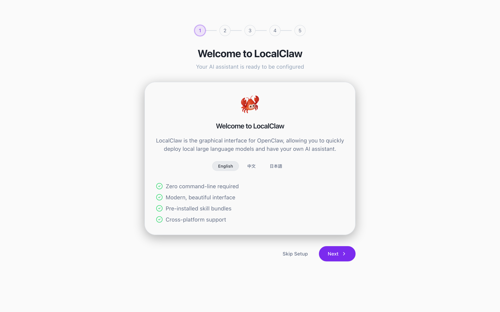

#### ステップ2: デプロイメントモードの選択

- 「設定中」ページに入り、使用モードを選択:
  - **クラウドモデル**: サードパーティのクラウドAPIを使用、ローカル設定不要、すぐに使用可能（ネットワークが必要、API呼び出しで課金）
  - **ローカルデプロイ**: オープンソースの大規模モデルをローカルで実行、データはローカルデバイスから完全に流出せず、プライバシーを保護、API料金ゼロ、オフラインで利用可能
- 選択後、「次へ」をクリック。2つのモードの後続プロセスは独立しており、別々に説明:

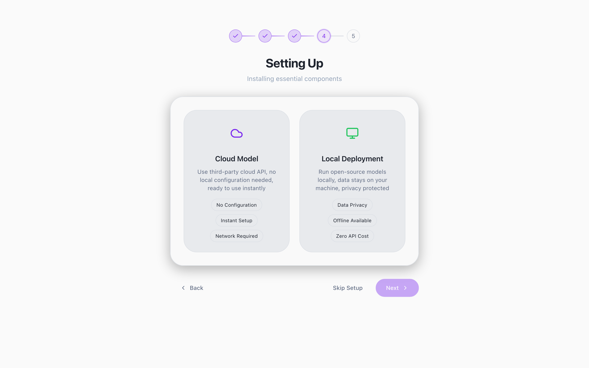

---

### [モードA: ローカルデプロイの完全なプロセス]

#### ステップ2-1: Ollama環境チェック

LocalClawのローカルデプロイはOllamaベースで実行され、ウィザードが自動的に環境検出とインストールを完了します:

- Ollamaがインストールされていない場合: ウィザードが自動的にOllamaのダウンロードとインストールプロセスをトリガーし、リアルタイムでダウンロード進捗が表示されます。[Ollama公式ウェブサイト](https://ollama.com/)にアクセスして手動でインストールすることも可能（Mac版は約130M、Windows版は約1.1G; Windowsユーザーはダウンロードを辛抱強く待ってください）
- すでにインストールされている場合: 実行状態とデフォルトポート（11434、ポートが利用可能であることを確認）を自動検出
- インストール完了後、自動的に次のステップに進む

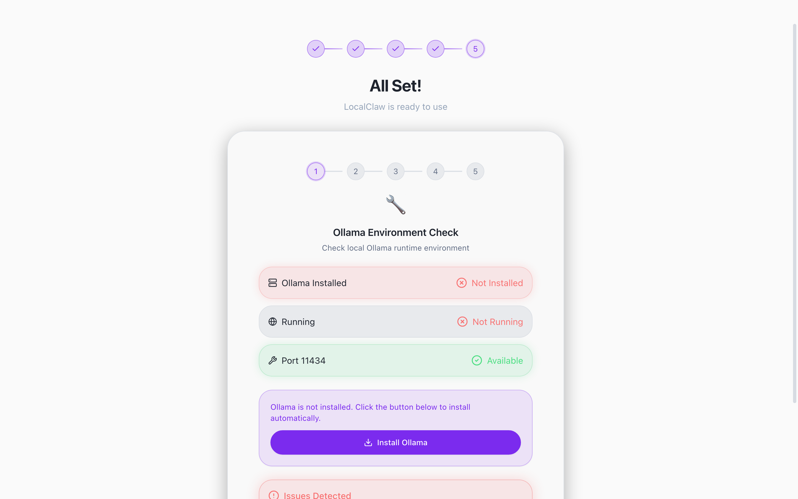

#### ステップ2-2: 自動ハードウェア検出

- ウィザードが自動的にデバイスのハードウェア情報を読み取ります: CPUコア数、メモリ、VRAM、システムプラットフォーム
- 情報が正しいことを確認後、「次へ: モデルを選択」をクリック

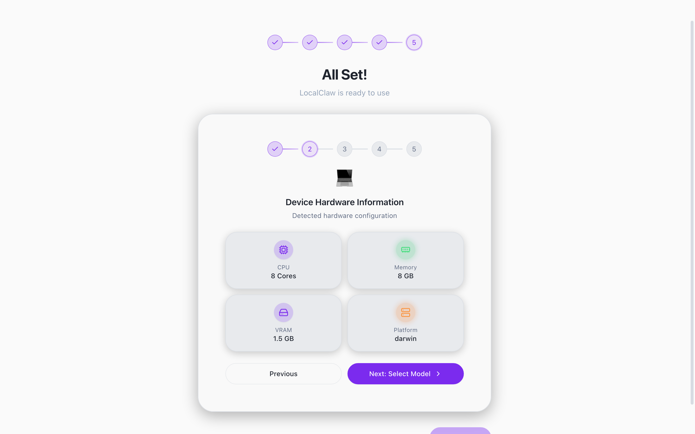

#### ステップ2-3: モデル選択

- ハードウェア構成に基づいて、ウィザードが自動的に適切なローカル大規模モデルを推奨します。ローカル使用に適した大規模モデルが合計20種類含まれています:
  - **Qwen 3.5 (0.8B)**: 極めて軽量、CPUのみでスムーズに実行可能、入門体験に適（「推奨構成」とマーク）
  - **Qwen 3.5 (2B)**: 超軽量で低遅延、応答速度が速く、高構成デバイスに適（「非推奨」とマークは現在のハードウェアでスムーズに実行できないことを意味）
- **推奨構成**とマークされたモデルを優先的に選択し、「次へ」をクリック

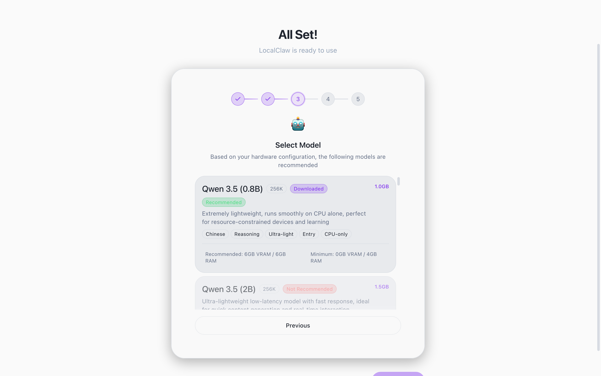

#### ステップ2-4: モデルダウンロード

- 選択したモデル情報（名前、サイズ）を確認し、「ダウンロード開始」をクリック
- モデルのダウンロードが完了するのを待ちます（0.8Bは約1.0GB、2Bは約1.5GB; ネットワークが悪い場合でも自動再開がサポートされます）
- ダウンロード完了後、自動的に次のステップに進む

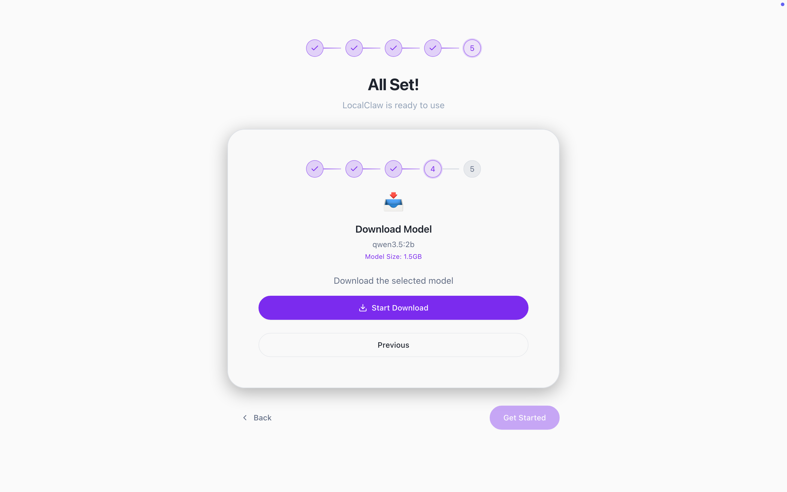

---

### [モードB: クラウドモードの完全なプロセス]

#### ステップ2-1: モデルプロバイダーの選択

- モデルプロバイダー選択ページに入り、ドロップダウンメニューはグローバル主流のAIサービスプロバイダーをサポート:
  - MiniMax、Moonshot (Kimi)、SiliconFlow、Anthropic (Claude)、OpenAI (GPT)、Google (Gemini)、OpenRouter
- 使用したいサービスプロバイダーを選択し、「次へ」をクリック

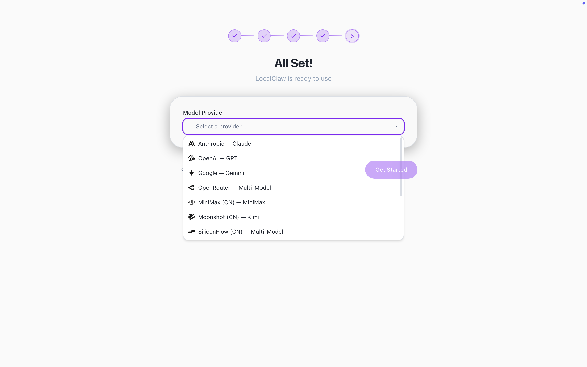

#### ステップ2-2: 本人確認

- ログイン方法を選択: **OAuthブラウザログイン** / **APIキー入力**
  - OAuth: 「ブラウザでログイン」をクリックし、ブラウザで承認ログインを完了
  - APIキー: サービスプロバイダーのAPIキーを入力; **キーはローカルにのみ保存され、アップロードされません**
- 確認成功後、次のステップに進む

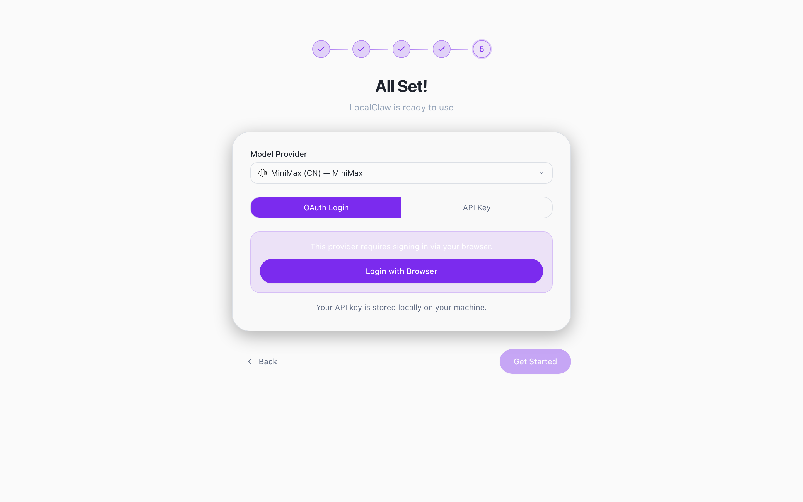

---

### ステップ3: 設定を完了して使用開始

- すべての設定が完了後、「準備完了！」ページに入り、デプロイが成功したことを確認（ローカルモードは「モデルが正常に追加されました」を表示、クラウドモードは「サービスプロバイダーが設定されました」を表示）
- ページは後続の操作をプロンプト:
  1. モデルセンターでローカルモデルとクラウドモデルを管理
- 「設定を完了」をクリックし、次に「使用開始」をクリックしてLocalClawメインインターフェースに入り、AIアシスタントの使用を開始！

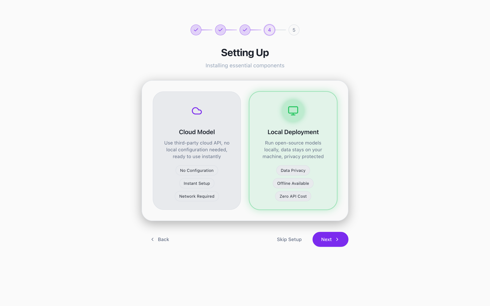

### ステップ4: 2つのモードの比較

| 機能 | クラウドモデルモード | ローカルデプロイモード |
|------|---------------------|------------------------|
| デプロイメント難易度 | 設定不要、すぐに使用可能 | ワンクリック自動デプロイ、ゼロコマンドライン |
| データプライバシー | データはサードパーティサービスプロバイダーにアップロード | 100%ローカル保存、データはデバイスから流出しない |
| オフライン使用 | サポートされていない、常にネットワークが必要 | 完全サポート、モデルダウンロード後はオフラインで利用可能 |
| コスト | API呼び出しで課金 | API料金ゼロ、モデルを一度ダウンロードするだけ |
| 適用シナリオ | クイック体験、高計算能力が必要なシナリオ | プライバシー重視、オフライン使用、長期低コスト使用 |

---

## IV. 核心機能モジュールの詳細説明

### 4.1 会話インターフェース（AIインタラクションのメインエントランス）

これはAIとインタラクションする核心インターフェースであり、LocalClawのデフォルトホームページでもあります:

- **クイックに会話を開始**: 左側の「+ 新しい会話」をクリックして、新しいチャットセッションを開始し、マルチセッション履歴管理をサポート
- **柔軟な切り替え能力**: トップバーでは、現在使用されている**ローカル大規模モデル**（例: Qwen 3.5 0.8B）または**クラウドモデル**をクイックに切り替え、異なるシナリオのニーズに適応
- **マルチモードインタラクション**: 3つのインタラクションモードをサポートし、異なるニーズに対応:
  - タスク処理: ワンタイムQ&Aで問題を迅速に解決
  - 継続実行: 長期タスクでAIが継続的にフォローアップ
  - マルチエージェント並列: マルチエージェントコラボレーションで複雑なタスクを役割別に処理
- **リアルタイムステータス表示**: 下部にゲートウェイ接続ステータスをリアルタイムで表示し、サービスの安定した運用を確保

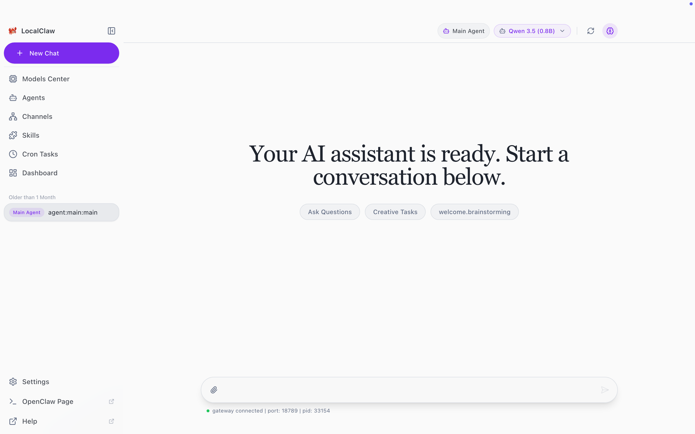

---

### 4.2 モデル管理センター（AIモデルの総合制御ハブ）

すべてのローカル/クラウドAIモデルをワンストップで管理し、運用ステータスを監視し、ワンクリックで問題を診断:

#### 4.2.1 クイック概要（ホームダッシュボード）

- **サービスステータス**: Ollamaサービスの実行ステータス、サービスアドレス、バージョン番号をリアルタイム表示
- **ハードウェア情報**: CPU、メモリ、GPU、VRAMの使用状況を一目で自動検出
- **モデル統計**: ダウンロード済みモデル数、実行中モデル数、総占有スペースを表示
- **パフォーマンス監視**: リアルタイムチャートでGPU利用率とVRAM占有率を表示し、パフォーマンス問題を迅速にトラブルシューティング

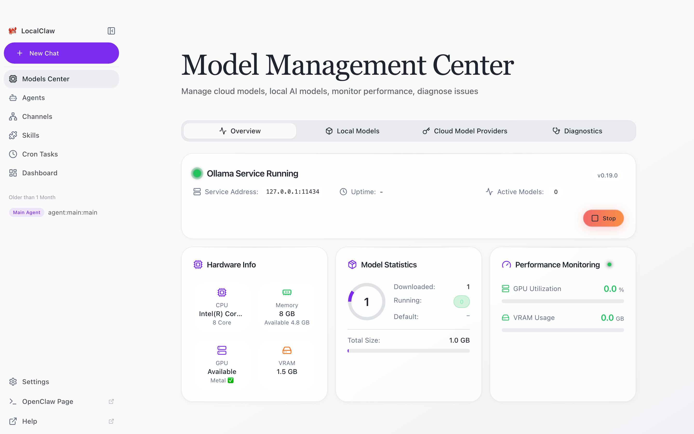

#### 4.2.2 ローカルモデル管理

- ダウンロード済みのローカルモデルリストを表示し、モデルサイズ、追加時間などの情報を含む
- 「+ モデルを追加」をクリックして、ワンクリックでより多くのローカル適応大規模モデルをダウンロード
- モデルの右側の削除ボタンをクリックして、ワンクリックで未使用のモデルをクリーンアップし、ストレージスペースを解放

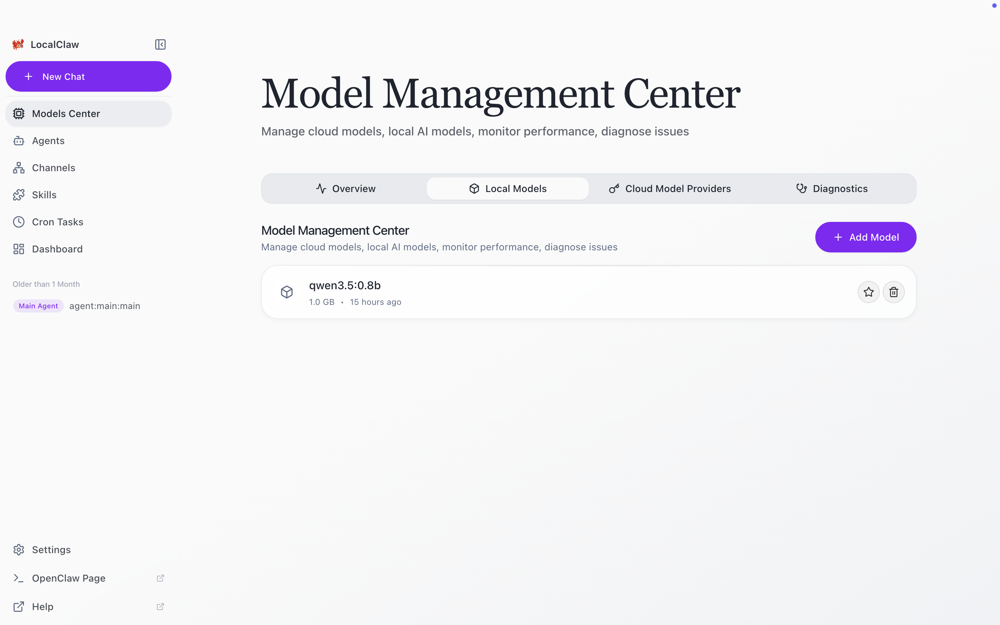

#### 4.2.3 クラウドモデルプロバイダー

- 接続済みのサードパーティサービスプロバイダー（MiniMax、OpenAI、Kimiなど）を管理し、「設定済み/デフォルト」ステータスでマーク
- 「+ プロバイダーを追加」をクリックして、新しいクラウドモデルサービスにクイックにアクセスし、OAuthログイン/APIキーの2つの方法をサポート
- デフォルトモデルを自由に設定し、インテリジェントルーティングルールを構成して、ローカル/クラウドモデルの自動切り替えを実現

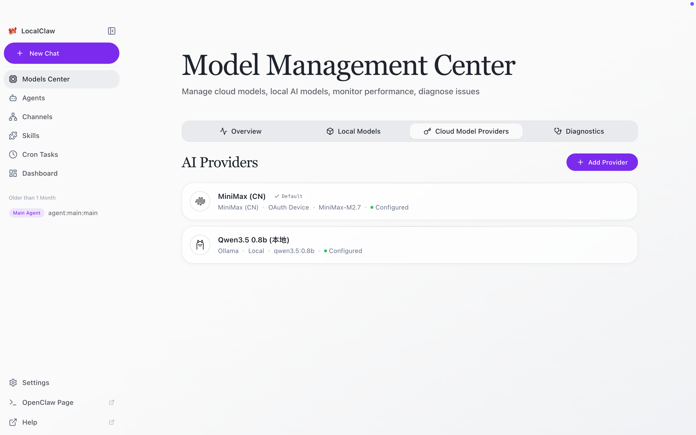

#### 4.2.4 診断センター

- 「完全な診断を開始」をクリックして、Ollama環境、ポート占有、ハードウェア互換性などの問題を自動検出
- 診断後、修復提案が提供され、一般的な運用異常をワンクリックで解決、手動トラブルシューティングは不要

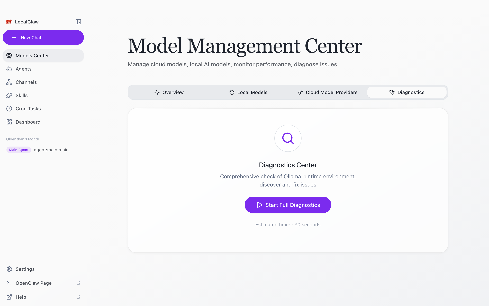

---

### 4.3 ダッシュボード（システムステータスとコスト概要）

システム運用ステータスとAIリソース消費をワンストップで掌握し、効率的に管理:

- **核心ステータスカード**:
  - ゲートウェイ: ゲートウェイの実行ステータス、ポート、PIDを表示し、正常なサービス接続を確保
  - チャンネル: 接続されたメッセージチャンネル数を表示（WeChat、Larkなど）
  - スキル: 有効化されたスキル数を表示し、AI能力の範囲を迅速に把握
  - 実行時間: 前回の再起動からの実行時間を表示
- **トークン消費統計**:
  - モデル/時間でフィルタリングして、過去7日/30日/すべてのトークン使用詳細を表示することをサポート
  - 各モデル/サービスプロバイダーの入力、出力、キャッシュ使用量、および対応するコストを明確に表示し、コスト管理を容易に（ローカルモデルはトークン料金ゼロ）

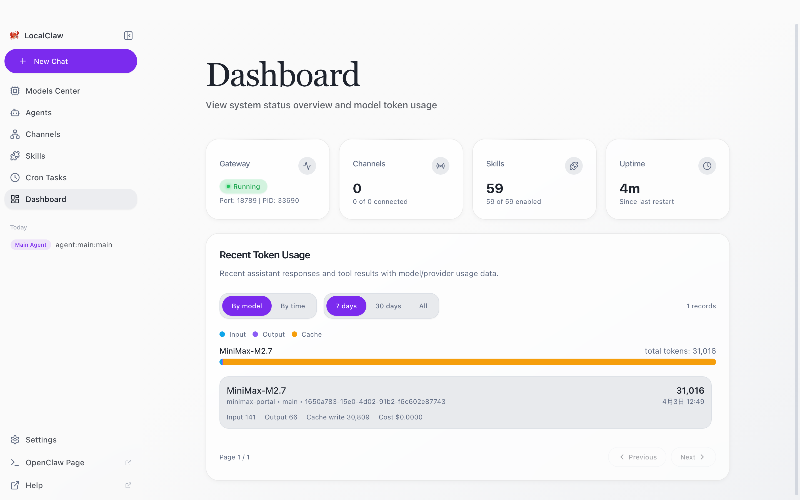

---

### 4.4 スキル管理（AI能力拡張センター）

LocalClawには50以上のすぐに使えるAIスキルが組み込まれており、さらにサードパーティのスキルマーケットもサポートし、AI能力を無限に拡張:

- **スキルリスト管理**:
  - 「組み込みスキル」と「マーケットスキル」をカテゴリ別に表示し、検索とバッチ有効化/無効化をサポート
  - 各スキルカードは機能説明、バージョン番号、インストールパスを表示; スイッチをクリックしてクイックに有効化/無効化
- **スキルインストールと管理**:
  - 「スキルをインストール」をクリックして、ClawHubマーケットからサードパーティのスキルを検索してインストール（Google Workspace、1Password、ノート管理などのツール統合）、ワンクリックインストール、追加設定は不要
  - 「スキルフォルダを開く」をサポートし、ローカルスキルファイルを手動で管理し、拡張能力をカスタマイズ

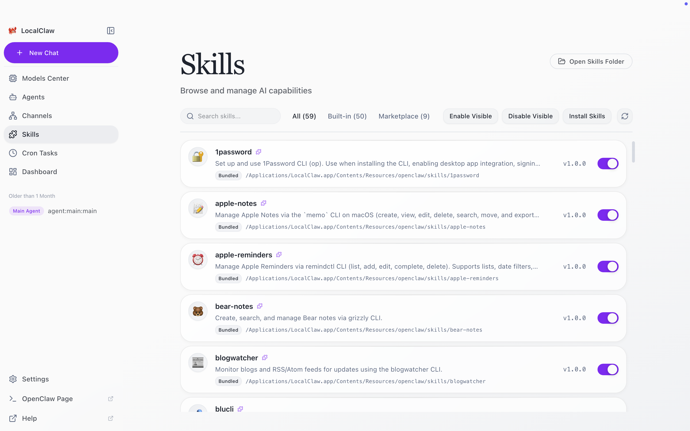

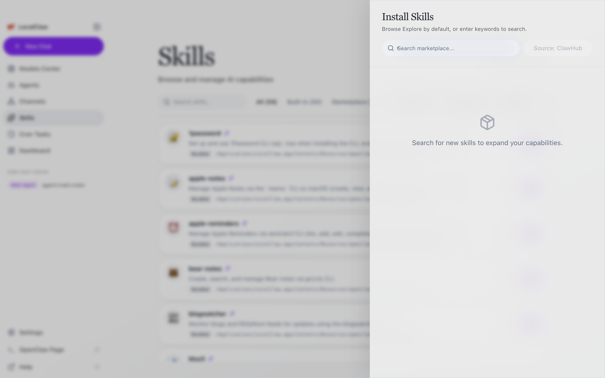

---

### 4.5 エージェント管理（マルチエージェントオーケストレーションセンター）

排他的なAIエージェントを作成し、異なるシナリオに排他的な人格、モデル、ワークフローを構成して、正確なルーティングを実現:

- **デフォルトエージェント**: システムは自動的に「Main Agent」をグローバルデフォルト応答エージェントとして作成し、基本設定を継承
- **新しいエージェントを追加**: 「+ エージェントを追加」をクリックして排他的なエージェントを作成し、以下を構成可能:
  - 排他的モデル（ローカル/クラウド）
  - スキル権限範囲
  - メッセージチャンネルルーティングバインディング
- **核心価値**: 特定のメッセージチャンネル（WeChat、Larkなど）を異なるエージェントにルーティングして、「ワークエージェントがオフィスメッセージを処理し、ライフエージェントが個人メッセージを処理する」などのシナリオを実現し、AI能力を柔軟に配分

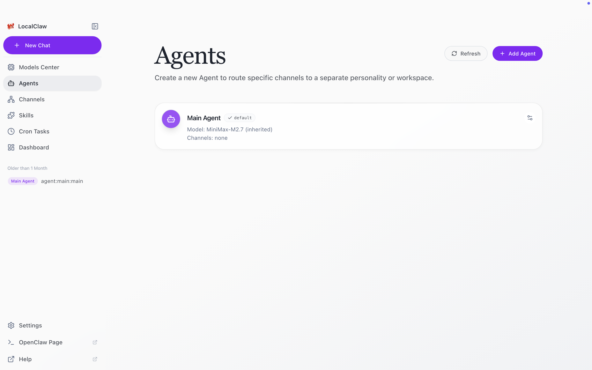

---

### 4.6 スケジュールタスク（AI自動化ワークフロー）

スケジュールタスクを通じてAI自動化を実現し、手動トリガーは不要で、プリセットワークフローを自動実行:

- **タスク概要**: すべてのスケジュールタスクの実行ステータス（実行中/一時停止/失敗）を表示し、更新、開始/停止、編集をサポート
- **タスク作成プロセス**:
  1. タスク名とAIプロンプトを入力（例: 「今日の朝のニュース+天気の概要を教えて」）;
  2. スケジュール計画を選択: 毎分/5分ごと/毎時/毎日/毎週/毎月、またはカスタムCron式をサポート;
  3. 配信設定: 結果をLocalClaw内にのみ保持するか、または設定済みの外部メッセージチャンネル（WeChat、Larkなど）にプッシュするかを選択

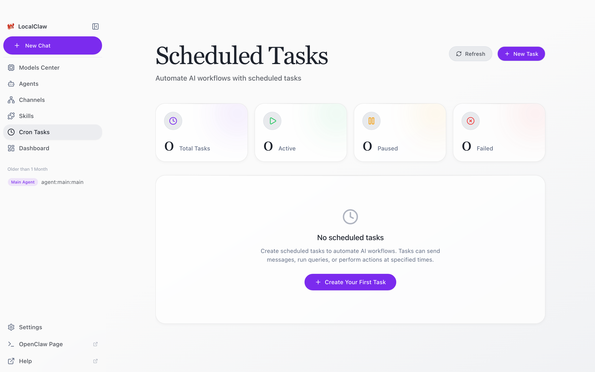

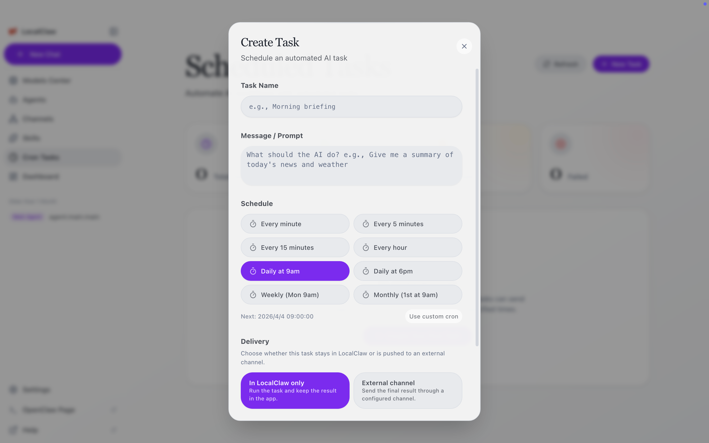

---

### 4.7 メッセージチャンネル（マルチチャンネルAIアクセス）

マルチプラットフォームのメッセージチャンネルを統合管理し、AIがソーシャル/オフィスメッセージに直接応答できるように:

- **フルプラットフォームサポート**: Telegram、Discord、WhatsApp、WeChat、DingTalk、Lark、WeChat Work、QQなどの主流プラットフォームをカバー
- **クイック設定**: 対応するチャンネルをクリックし、ガイドに従ってAPIキー/アプリケーションIDを入力し、ロボット作成を完了すると、AIが対応プラットフォームでリアルタイムにメッセージに応答
- **エージェントルーティングバインディング**: チャンネルを排他的エージェントにバインドして、異なるチャンネルで差別化されたAI応答を実現し、オフィスやライフなどのマルチシナリオのニーズに対応

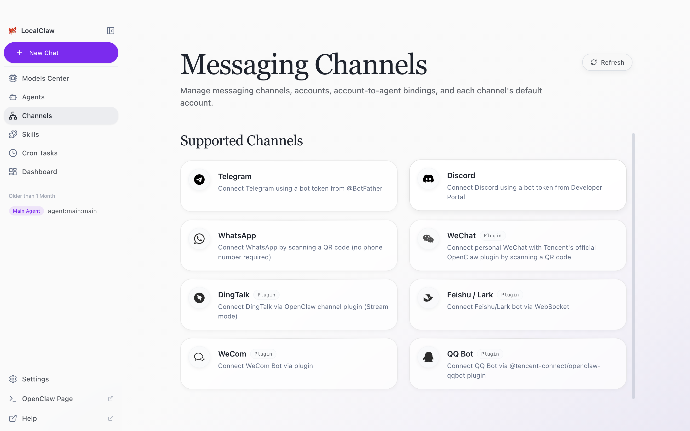

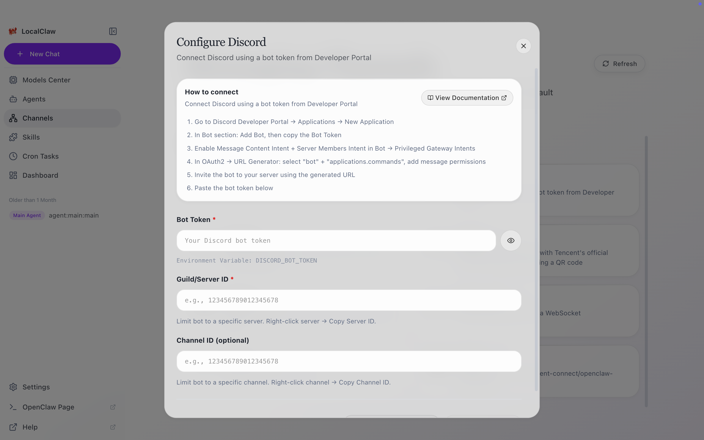

---

## V. 一般的な問題とトラブルシューティング

### 1. Ollamaのインストール/実行異常

- 解決策: 「モデル管理センター - 診断センター」に入り、「完全な診断を開始」をクリック。システムが自動的に問題を検出して修正します; Ollama公式ウェブサイトにアクセスして手動でダウンロードしてインストールすることも可能。インストール前にポート11434が占有されていないことを確認

### 2. ローカルモデルのダウンロードが遅い/中断される

- 解決策: より小さな軽量モデル（例: Qwen 3.5 0.8B）を優先的に選択し、ダウンロード速度を効果的に向上

### 3. モデル/エージェント応答の優先度を切り替えたい

- 解決策: 「モデル管理センター - クラウドモデルプロバイダー」で、対象モデルを「デフォルト」に設定; 「エージェント管理」で、対象エージェントをデフォルトルートに設定

### 4. スキルのインストール失敗/有効化できない

- 解決策: まずスキルの互換性をチェックし、システムがスキルの実行要件を満たしていることを確認; それでも有効化できない場合は、「スキル管理」でスキルを再インストールするか、スキルファイルを手動で置き換える

### 5. スケジュールタスクが実行されない

- 解決策: まずスケジュールタスクのスケジュール時間設定が正しいかチェックし、LocalClawが実行状態にあることを確認; 同様に配信チャンネルの設定が正しいこと、ネットワーク接続が正常であることを確認すれば、正常に実行が再開されます

---

## VI. お問い合わせ

- **公式ウェブサイト**: [https://www.localclaw.me](https://www.localclaw.me)
- **技術サポート**: GitHub Issues(https://github.com/Local-AI-X/localclaw/issues)を通じて質問を送信し、完全にAI使用保証を提供します
- **GitHub**: [https://github.com/Local-AI-X/localclaw](https://github.com/Local-AI-X/localclaw)

---

💡 **核心ヒント**: LocalClawは単なるローカル大規模モデルデプロイメントツールではなく、あなたの**排他的なAIワークハブ**です。ローカルプライバシーデプロイメント、クラウド柔軟な呼び出し、自動化オフィス、またはマルチエージェントコラボレーションが必要であっても、ここでワンストップで実現でき、完全にあなたのAIデータと体験をコントロールできます。

---

## 謝辞

LocalClawは優れたオープンソースプロジェクトをベースに構築されています:

- [OpenClaw](https://github.com/OpenClaw) – AIエージェントランタイム
- [Electron](https://www.electronjs.org/) – クロスプラットフォームデスクトップフレームワーク
- [React](https://react.dev/) – UIコンポーネントライブラリ
- [shadcn/ui](https://ui.shadcn.com/) – 精美に設計されたコンポーネント
- [Zustand](https://github.com/pmndrs/zustand) – 軽量な状態管理
- [Ollama](https://ollama.com/) – ローカル大規模言語モデル

---
