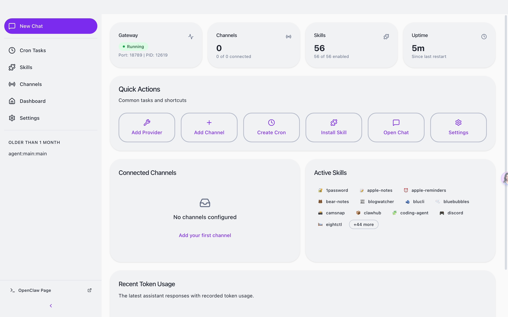

<h1 align="center">LocalClaw</h1>

<p align="center">
  <strong>OpenClaw AI エージェントのデスクトップ GUI</strong>
</p>

<p align="center">
  <a href="#features">機能</a> •
  <a href="#why-localclaw">なぜ LocalClaw か</a> •
  <a href="#getting-started">はじめに</a> •
  <a href="#architecture">アーキテクチャ</a> •
  <a href="#ollama">ローカルモデル</a>
</p>

<p align="center">
  <a href="README.md">English</a> | <a href="README.zh-CN.md">简体中文</a> | 日本語
</p>

---

## プロジェクト概要

LocalClaw は [OpenClaw](https://github.com/OpenClaw) をベースに構築され、**デプロイ可能なローカル LLM バージョンの OpenClaw デスクトップクライアント**です。一般ユーザー向けに設計されており、ワンクリックでデプロイ可能なローカル LLM OpenClaw を楽しみ、トークンコストゼロとローカルデータセキュリティを実現し、複雑な設定にさよならし、真の AI の自由を実現します：

1. コマンドライン / ターミナル操作にさよなら。AI 機能は視覚化され、初心者でもデプロイ可能なローカル LLM OpenClaw を楽しめます；
2. 高品質なクラウドモデルプロバイダーとオープンソースの大規模モデルを事前設定し、インテリジェントルーティングアルゴリズムに基づいて最適なモデルを自動選択；
3. ハードウェア構成に基づいてデプロイ可能なローカル大規模モデルを自動的にマッチングし、パラメータを自動調整。ゼロ障壁、ゼロコストでローカル大規模モデルを使用して OpenClaw を実行し、簡単に AI の自由を実現。

- [公式ウェブサイト](https://www.localclaw.me)

---

## インターフェースプレビュー

<p align="center">
  <strong>チャットインターフェース</strong>
  
</p>

<p align="center">
  <strong>ダッシュボード</strong>
  
</p>

<p align="center">
  <strong>スキル管理</strong>
  
</p>

<p align="center">
  <strong>Cron タスク</strong>
  
</p>

<p align="center">
  <strong>ローカル大規模モデルの選択</strong>
  
</p>

<p align="center">
  <strong>プロバイダークラウド設定</strong>
  
</p>

<p align="center">
  <strong>設定</strong>
  
</p>


---

## なぜ LocalClaw か

**LocalClaw** は、一般ユーザー向けに設計された OpenClaw クライアントのローカル LLM バージョンです。誰もが簡単にローカル大規模モデルで OpenClaw を実行でき、ゼロコストで使用し、AI の自由を実現できます。

| 課題 | LocalClaw の解決策 |
|------|-------------------|
| 複雑な CLI セットアップ | ワンクリックインストール、ガイド付きセットアップウィザード |
| 複雑なモデル選択と設定 | ハードウェアに基づく自動モデル推奨、手動設定不要 |
| 設定ファイルの編集 | リアルタイム検証付きのビジュアル設定 |
| プロセス管理 | 自動 Gateway ライフサイクル管理 |
| 複数の AI プロバイダー | 統一されたプロバイダー設定パネル |
| スキル/プラグインのインストール | 内蔵スキルマーケットプレイスと管理 |

### 内蔵 OpenClaw

LocalClaw は、公式 **OpenClaw** コアを直接ベースに構築されています。別途インストールする必要はなく、ランタイムをアプリケーションに埋め込むことで、シームレスな「すぐに使える」体験を提供します。

私たちは、アップストリームの OpenClaw プロジェクトと厳密に同期することを約束し、常に公式リリースが提供する最新の機能、安定性の向上、エコシステムの互換性にアクセスできるようにします。

---

## 機能

### 🎯 ゼロ設定障壁
直感的なグラフィカルインターフェースを通じて、インストールから最初の AI インタラクションまでのセットアッププロセス全体を完了します。ターミナルコマンドも YAML ファイルも、環境変数の検索も不要です。

### 💬 インテリジェントチャットインターフェース
モダンなチャット体験を通じて AI エージェントとコミュニケーションを取ります。複数の会話コンテキスト、メッセージ履歴、Markdown リッチコンテンツレンダリングをサポートします。

### 🤖 Ollama ローカルモデルサポート
ローカルで大規模言語モデルを実行するための Ollama 統合を内蔵：
- Ollama サービスの自動検出と起動
- 推奨モデル（Qwen、Llama、DeepSeek など）のワンクリックダウンロード
- ハードウェア要件の検出とモデルの推奨
- マルチモーダルモデル（視覚理解）のサポート

### 📡 マルチチャンネル管理
複数の AI チャンネルを同時に設定および監視します。各チャンネルは独立して実行され、異なるタスクに特化したエージェントを実行できます。

### ⏰ Cron スケジュール自動化
AI タスクを自動的に実行するようにスケジュールします。トリガーを定義し、間隔を設定し、AI エージェントが人間の介入なしに昼夜問わず作業できるようにします。

### 🧩 拡張可能なスキルシステム
事前構築されたスキルを通じて AI エージェントの機能を拡張します。統合されたスキルパネルからスキルを参照、インストール、管理します—パッケージマネージャーは不要です。

### 🔐 安全なプロバイダー統合
複数の AI プロバイダー（OpenAI、Anthropic、Moonshot など）に接続し、認証情報はシステムネイティブのキーチェーンに安全に保存されます。

### 🌙 アダプティブテーマ
ライトモード、ダークモード、またはシステム同期テーマ。LocalClaw はお好みに自動的に適応します。

### 🔄 自動アップデート
アリババクラウド OSS（国内ユーザー向け）と GitHub Releases のデュアルソースアップデートをサポートする内蔵自動アップデートメカニズム。

---

## 技術アーキテクチャ

### デュアルプロセスアーキテクチャ

LocalClaw は**デュアルプロセスアーキテクチャ**を採用し、UI の関心事と AI ランタイム操作を分離します：

```
┌─────────────────────────────────────────────────────────────────┐
│                     LocalClaw デスクトップアプリ                  │
│                                                                  │
│  ┌────────────────────────────────────────────────────────────┐  │
│  │              Electron メインプロセス                        │  │
│  │  • ウィンドウとアプリケーションライフサイクル管理            │  │
│  │  • Gateway プロセス監視                                     │  │
│  │  • システム統合（トレイ、通知、キーチェーン）               │  │
│  │  • 自動アップデートオーケストレーション                     │  │
│  │  • Ollama ローカルモデルサービス管理                        │  │
│  └────────────────────────────────────────────────────────────┘  │
│                              │                                    │
│                              │ IPC                                │
│                              ▼                                    │
│  ┌────────────────────────────────────────────────────────────┐  │
│  │              React レンダラープロセス                       │  │
│  │  • モダンなコンポーネント化 UI（React 19）                  │  │
│  │  • Zustand ステート管理                                     │  │
│  │  • リアルタイム WebSocket 通信                              │  │
│  │  • Markdown リッチテキストレンダリング                      │  │
│  │  • i18n 多言語サポート                                      │  │
│  └────────────────────────────────────────────────────────────┘  │
└──────────────────────────────┬──────────────────────────────────┘
                               │
                               │ WebSocket (JSON-RPC)
                               ▼
┌─────────────────────────────────────────────────────────────────┐
│                     OpenClaw Gateway                             │
│                                                                  │
│  • AI エージェントランタイムとオーケストレーション              │
│  • メッセージチャンネル管理                                      │
│  • スキル/プラグイン実行環境                                    │
│  • プロバイダー抽象化レイヤー                                    │
│  • デバイス ID 認証                                              │
└─────────────────────────────────────────────────────────────────┘
```

### 設計原則

- **プロセス分離**：AI ランタイムは別プロセスで実行され、重い計算中でも UI が応答性を保つようにします
- **優雅な回復**：内蔵の指数バックオフ再接続ロジックが、一時的な障害を自動的に処理します
- **安全な保存**：API キーと機密データは、オペレーティングシステムのネイティブ安全保存メカニズムを活用します
- **ホットリロード**：開発モードは、Gateway を再起動せずに即座の UI 更新をサポートします

---

## はじめに

### システム要件

- **オペレーティングシステム**: macOS 11+、Windows 10+、または Linux（Ubuntu 20.04+）
- **メモリ**: 最低 4GB RAM（推奨 8GB）
- **ストレージ**: 1GB の利用可能なディスク容量
- **Node.js**: 22+（開発用）
- **パッケージマネージャー**: pnpm 10+（推奨）

### インストール

#### プリビルドバージョン（推奨）

[Releases](https://github.com/Local-AI-X/localclaw/releases) ページから、お使いのプラットフォーム向けの最新バージョンをダウンロードしてください。


### 初回起動

LocalClaw を初めて起動すると、**セットアップウィザード**がガイドします：

1. **言語と地域** – 優先ロケールを設定
2. **AI プロバイダー** – サポートされているプロバイダーの API キーを入力
3. **スキルパッケージ** – 一般的なユースケースの事前設定スキルを選択
4. **検証** – メインインターフェースに入る前に設定をテスト

> **Moonshot (Kimi) ユーザーの注意**: LocalClaw はデフォルトで Kimi Web 検索を有効にしています。Moonshot を設定すると、LocalClaw は Kimi Web 検索も OpenClaw 設定の中国エンドポイント (`https://api.moonshot.cn/v1`) に同期します。

### プロキシ設定

LocalClaw には、Electron、OpenClaw Gateway、または Telegram などのチャンネルがローカルプロキシクライアントを通じてインターネットにアクセスする必要がある環境向けの内蔵プロキシ設定が含まれています。

**設定 → Gateway → プロキシ**を開いて設定します：

- **プロキシサーバー**: すべてのリクエストのデフォルトプロキシ
- **バイパスルール**: 直接接続すべきホスト、セミコロン、カンマ、または改行で区切る
- **開発者モード**では、以下の上書きも選択できます：
  - **HTTP プロキシ**
  - **HTTPS プロキシ**
  - **ALL_PROXY / SOCKS**

推奨ローカルプロキシの例：

```text
プロキシサーバー: http://127.0.0.1:7890
```

---

## Ollama ローカルモデル {#ollama}

LocalClaw には Ollama のサポートが内蔵されており、ローカルで大規模言語モデルを実行できます：

### サポートされているモデル

| モデル | サイズ | VRAM 要件 | 特徴 |
|------|------|---------|------|
| Qwen 3.5 (14B) | 9.4GB | 16GB+ | 中国語最適化、強力な推論 |
| Qwen 3.5 (7B) | 4.7GB | 8GB+ | パフォーマンスとリソースのバランス |
| Llama 3.3 (8B) | 4.7GB | 8GB+ | 英語シナリオで優秀 |
| DeepSeek R1 (14B) | 9.3GB | 16GB+ | コードと推論 |
| GLM 4 (9B) | 6.3GB | 10GB+ | 中国語対話 |

### 自動管理

- 起動時に Ollama サービスを自動検出および起動
- ハードウェア構成に基づいて適切なモデルを推奨
- モデルのワンクリックダウンロードとインストール
- バックグラウンドダウンロード進行状況のリアルタイム表示


## ユースケース

### 🤖 パーソナル AI アシスタント
質問に答え、メールを作成し、ドキュメントを要約し、日常のタスクを支援できる汎用 AI エージェントを設定します—すべてクリーンなデスクトップインターフェースを通じて行えます。

### 📊 自動監視
ニュースフィードを監視し、価格を追跡し、特定のイベントを監視するためにスケジュールされたエージェントを設定します。結果は優先通知チャンネルに送信されます。

### 💻 開発者の生産性
AI を開発ワークフローに統合します。エージェントを使用してコードをレビューし、ドキュメントを生成したり、反復的なコーディングタスクを自動化したりします。

### 🔄 ワークフロー自動化
複数のスキルを連鎖させて、複雑な自動化パイプラインを作成します。データを処理し、コンテンツを変換し、アクションをトリガーします—すべて視覚的にオーケストレーションされます。


## 謝辞

LocalClaw は、優れたオープンソースプロジェクトに基づいて構築されています：

- [OpenClaw](https://github.com/OpenClaw) – AI エージェントランタイム
- [Electron](https://www.electronjs.org/) – クロスプラットフォームデスクトップフレームワーク
- [React](https://react.dev/) – UI コンポーネントライブラリ
- [shadcn/ui](https://ui.shadcn.com/) – 美しくデザインされたコンポーネント
- [Zustand](https://github.com/pmndrs/zustand) – 軽量ステート管理
- [Ollama](https://ollama.com/) – ローカル大規模言語モデル

---

## コミュニティ

コミュニティに参加して、他のユーザーと交流し、サポートを受け、経験を共有してください。

| WeCom | Feishu | 
| :---: | :---: | :---: |
|  |  |

---
