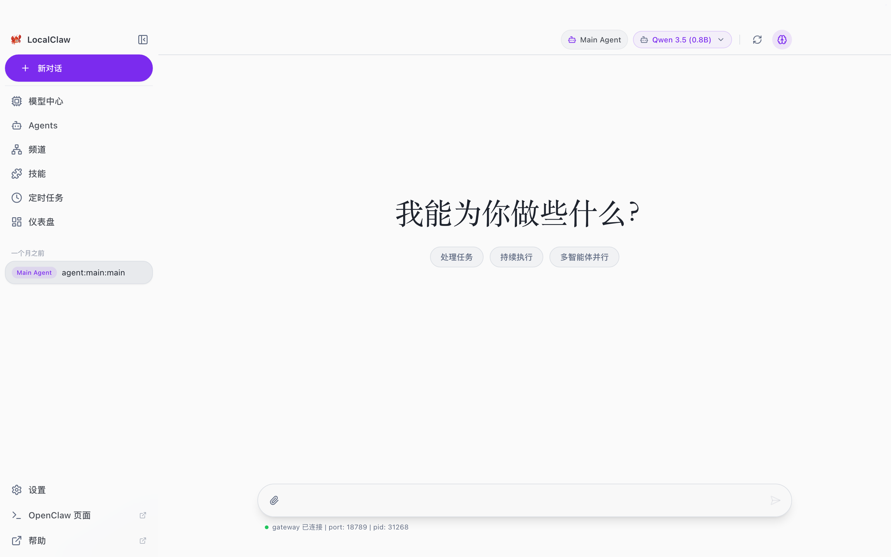
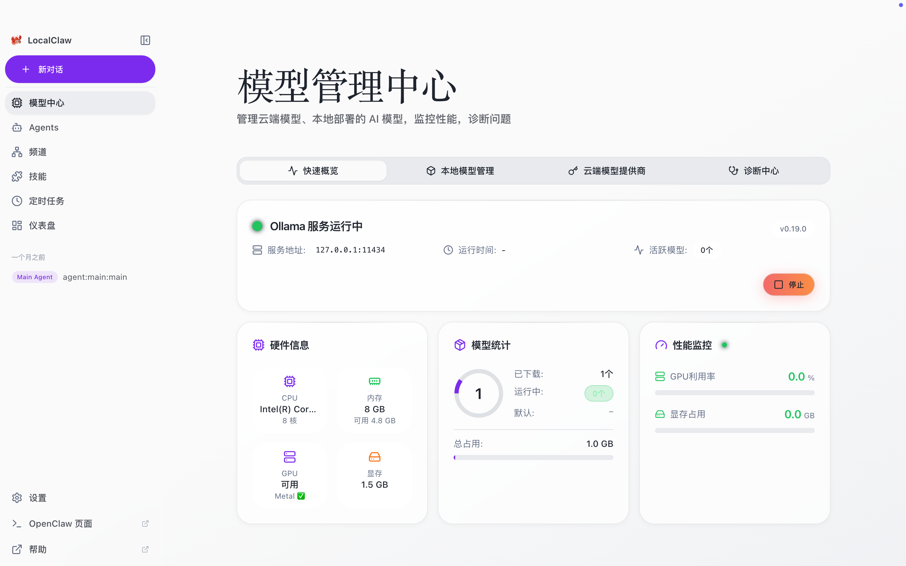

<h1 align="center">LocalClaw</h1>

  <strong>All-in-One AI Desktop Client Based on OpenClaw · Zero Command Line · Local/Cloud Full Support · One-Stop AI Work Hub</strong>

  <a href="README.md">English</a> | <a href="README.zh-CN.md">简体中文</a> | <a href="README.ja-JP.md">日本語</a>

---

# LocalClaw Quick Start Guide

**All-in-One AI Desktop Client Based on OpenClaw · Zero Command Line · Local/Cloud Full Support · One-Stop AI Work Hub**

Official Website: [https://www.localclaw.me](https://www.localclaw.me)

---

## I. Product Introduction

LocalClaw is an **all-in-one AI desktop client** developed based on OpenClaw. One-click local deployment of large models is its core feature, and it is even more a one-stop AI work hub: it supports seamless access to cloud API models, integrates full capabilities such as conversational interaction, model management, skill expansion, multi-Agent orchestration, scheduled automation, and multi-channel message access. It completely eliminates complex command lines, allowing even beginners to fully control their AI experience.

### Core Advantages

✅ **Full Mode Compatibility**: Dual support for local deployment and cloud API, flexible switching to meet different scenarios

✅ **Zero Threshold to Get Started**: Visual wizards replace command lines, full graphical operation, no technical background required

✅ **Full Function Integration**: One-stop solution for conversations, models, skills, Agents, automation, and multi-channel access

✅ **Data Sovereignty Guarantee**: 100% of data in local mode never leaves the device, privacy is fully controllable, and there are zero API fees

✅ **Cross-Platform Adaptation**: Natively supports Windows and macOS, perfectly adapting to various hardware

---

## II. System Pre-Requirements

- **Operating System**: Windows 10+ / macOS 15+ (full adaptation for Apple Silicon / Intel)
- **Hardware Recommendations**:
  - Local Operation: 8GB RAM/8GB VRAM minimum (8GB+ recommended); an independent graphics card can provide better performance
  - Cloud Operation: Only a stable network connection is required
- **Network Description**: Internet connection is required for the first model download/connection to cloud service providers; **full offline operation is supported after local models are downloaded**

---

## III. 5-Step Initialization Wizard (Must-Read for First Launch)

### 3.1 Install the Client

1. Visit the LocalClaw official website: [https://www.localclaw.me](https://www.localclaw.me)
2. Download the installation package for your corresponding system (Windows / macOS)
3. Complete the installation as prompted. The first launch will enter the **5-step initialization wizard**, which will guide you through the configuration in full.

---

### 3.2 Full Process of Initialization Wizard

#### Step 1: Welcome and Language Selection

Corresponding Interface:

- Enter the welcome page on first launch and confirm the product introduction and core advantages
- Select the interface language: supports **Chinese / English / 日本語**, with "Chinese" selected by default
- Click "Next" to continue, or click "Skip Settings" to enter the main interface directly (configuration can be completed in the Model Center later)

#### Step 2: Deployment Mode Selection

- Enter the "Setting Up" page and select your usage mode:
  - **Cloud Model**: Use third-party cloud APIs, no local configuration required, ready to use immediately (requires network, charged by API calls)
  - **Local Deployment**: Run open-source large models locally, data never leaves the local device, protect privacy, zero API fees, available offline
- After selection, click "Next". The subsequent processes for the two modes are independent and explained separately:

---

### [Mode A: Full Process of Local Deployment]

#### Step 2-1: Ollama Environment Check

LocalClaw's local deployment runs based on Ollama, and the wizard will automatically complete environment detection and installation:

- If Ollama is not installed: The wizard will automatically trigger the download and installation process of Ollama, with real-time download progress visible; you can also manually visit the [Ollama official website](https://ollama.com/) to install it (the Mac version is about 130M, the Windows version is about 1.1G; Windows users please wait patiently for the download)
- If already installed: Automatically detect the running status and default port (11434, ensure the port is available)
- Automatically enter the next step after installation is complete

#### Step 2-2: Automatic Hardware Detection

- The wizard automatically reads your device's hardware information: CPU cores, memory, VRAM, system platform
- After confirming the information is correct, click "Next: Select Model"

#### Step 2-3: Model Selection

- Based on your hardware configuration, the wizard automatically recommends suitable local large models, including a total of 20 large models suitable for local use:
  - **Qwen 3.5 (0.8B)**: Extremely lightweight, can run smoothly on CPU only, suitable for entry-level experience (marked as "Recommended Configuration")
  - **Qwen 3.5 (2B)**: Ultra-lightweight and low-latency, fast response speed, suitable for high-configuration devices (marked as "Not Recommended" means the current hardware cannot run smoothly)
- Please prioritize selecting models marked as **Recommended Configuration**, then click "Next"

#### Step 2-4: Model Download

- Confirm the selected model information (name, size), then click "Start Download"
- Wait for the model download to complete (0.8B is about 1.0GB, 2B is about 1.5GB; automatic resumption is supported if the network is poor)
- Automatically enter the next step after download is complete

---

### [Mode B: Full Process of Cloud Mode]

#### Step 2-1: Model Provider Selection

- Enter the model provider selection page, the drop-down menu supports mainstream global AI service providers:
  - MiniMax, Moonshot (Kimi), SiliconFlow, Anthropic (Claude), OpenAI (GPT), Google (Gemini), OpenRouter
- Select the service provider you want to use, then click "Next"

#### Step 2-2: Identity Verification

- Select the login method: **OAuth Browser Login** / **API Key Input**
  - OAuth: Click "Login with Browser" and complete authorized login in the browser
  - API Key: Enter your service provider's API key; **the key is only stored locally and will not be uploaded**
- Enter the next step after verification is successful

---

### Step 3: Complete Settings and Start Using

- After all configurations are completed, enter the "Ready!" page and confirm the deployment is successful (local mode shows "Model Added Successfully", cloud mode shows "Service Provider Configured Successfully")
- The page prompts subsequent operations:
  1. Manage local models and cloud models in the Model Center
- Click "Complete Settings", then click "Start Using" to enter the LocalClaw main interface and start using the AI assistant!

### Step 4: Comparison of the Two Modes

| Features | Cloud Model Mode | Local Deployment Mode |
|----------|------------------|----------------------|
| Deployment Difficulty | No configuration required, ready to use immediately | One-click automatic deployment, zero command line |
| Data Privacy | Data uploaded to third-party service providers | 100% locally stored, data never leaves the device |
| Offline Use | Not supported, network required at all times | Fully supported, available offline after model download |
| Cost | Charged by API calls | Zero API fees, only need to download the model once |
| Applicable Scenarios | Quick experience, high computing power demand scenarios | Privacy-sensitive, offline use, long-term low-cost use |

---

## IV. Detailed Explanation of Core Function Modules

### 4.1 Conversation Interface (Main Entrance for AI Interaction)

This is the core interface for you to interact with AI, and also the default homepage of LocalClaw:

- **Quickly Initiate a Conversation**: Click "+ New Conversation" on the left to start a new chat session, supporting multi-session history management.
- **Flexible Switching Capability**: The top bar allows quick switching between the currently used **local large model** (such as Qwen 3.5 0.8B) or **cloud model** to adapt to different scenario needs.
- **Multi-Mode Interaction**: Supports three interaction modes to meet different needs:
  - Task Processing: One-time Q&A to solve problems quickly
  - Continuous Execution: Long-term tasks with continuous AI follow-up
  - Multi-Agent Parallel: Multi-Agent collaboration to handle complex tasks by role
- **Real-Time Status Display**: The bottom displays the gateway connection status in real time to ensure stable service operation.

---

### 4.2 Model Management Center (Total Control Hub for AI Models)

One-stop management of all local/cloud AI models, monitoring operation status, and one-click problem diagnosis:

#### 4.2.1 Quick Overview (Home Dashboard)

- **Service Status**: Real-time display of Ollama service running status, service address, and version number.
- **Hardware Information**: Automatically detect CPU, memory, GPU, and VRAM usage at a glance.
- **Model Statistics**: Display the number of downloaded models, number of running models, and total occupied space.
- **Performance Monitoring**: Real-time charts display GPU utilization and VRAM occupancy to quickly troubleshoot performance issues.

#### 4.2.2 Local Model Management

- View the list of downloaded local models, including model size, addition time, and other information.
- Click "+ Add Model" to download more local-adapted large models with one click.
- Click the delete button on the right side of the model to clean up unused models with one click and free up storage space.

#### 4.2.3 Cloud Model Providers

- Manage connected third-party service providers (such as MiniMax, OpenAI, Kimi, etc.), marked with "Configured/Default" status.
- Click "+ Add Provider" to quickly access new cloud model services, supporting two methods: OAuth login/API key.
- Freely set the default model and configure intelligent routing rules to realize automatic switching between local/cloud models.

#### 4.2.4 Diagnostic Center

- Click "Start Full Diagnosis" to automatically detect issues such as Ollama environment, port occupancy, and hardware compatibility.
- After diagnosis, repair suggestions are provided to solve common operation abnormalities with one click, no manual troubleshooting required.

---

### 4.3 Dashboard (System Status and Cost Overview)

One-stop mastery of system operation status and AI resource consumption for efficient management:

- **Core Status Cards**:
  - Gateway: Displays gateway running status, port, and PID to ensure normal service connection.
  - Channels: Displays the number of connected message channels (such as WeChat, Lark, etc.).
  - Skills: Displays the number of enabled skills to quickly grasp the scope of AI capabilities.
  - Running Time: Displays the running time since the last restart.
- **Token Consumption Statistics**:
  - Supports filtering by model/time to view Token usage details for the past 7 days/30 days/all time.
  - Clearly displays input, output, cache usage, and corresponding costs for each model/service provider, facilitating cost control (zero Token fees for local models).

---

### 4.4 Skill Management (AI Capability Expansion Center)

LocalClaw has built-in 50+ out-of-the-box AI skills, and also supports third-party skill markets for unlimited expansion of AI capabilities:

- **Skill List Management**:
  - View "Built-in Skills" and "Market Skills" by category, supporting search and batch enable/disable.
  - Each skill card displays function description, version number, and installation path; click the switch to quickly enable/disable.
- **Skill Installation and Management**:
  - Click "Install Skill" to search and install third-party skills from the ClawHub market (such as Google Workspace, 1Password, note management and other tool integrations), one-click installation, no additional configuration required.
  - Supports "Open Skill Folder" to manually manage local skill files and customize expansion capabilities.

---

### 4.5 Agent Management (Multi-Agent Orchestration Center)

Create exclusive AI agents, configure exclusive personalities, models, and workflows for different scenarios to achieve precise routing:

- **Default Agent**: The system automatically creates "Main Agent" as the global default response agent, inheriting basic configurations.
- **Add New Agent**: Click "+ Add Agent" to create an exclusive agent, which can be configured with:
  - Exclusive model (local/cloud)
  - Skill permission scope
  - Message channel routing binding
- **Core Value**: Route specific message channels (such as WeChat, Lark) to different Agents to achieve scenarios such as "Work Agent handles office messages, Life Agent handles personal messages", flexibly allocating AI capabilities.

---

### 4.6 Scheduled Tasks (AI Automated Workflows)

Realize AI automation through scheduled tasks, no manual triggering required, and automatically execute preset workflows:

- **Task Overview**: View the running status (Running/Paused/Failed) of all scheduled tasks, supporting refresh, start/stop, and edit.
- **Task Creation Process**:
  1. Fill in the task name and AI prompt (such as "Give me a summary of today's morning news + weather");
  2. Select the scheduling plan: support every minute/every 5 minutes/hourly/daily/weekly/monthly, or custom Cron expression;
  3. Delivery settings: choose to keep the results only in LocalClaw, or push to the configured external message channels (such as WeChat, Lark).

---

### 4.7 Message Channels (Multi-Channel AI Access)

Unified management of multi-platform message channels, allowing AI to directly respond to your social/office messages:

- **Full Platform Support**: Covers mainstream platforms such as Telegram, Discord, WhatsApp, WeChat, DingTalk, Lark, WeChat Work, and QQ.
- **Quick Configuration**: Click the corresponding channel, fill in the API key/application ID according to the guide, complete the robot creation, and AI can respond to messages in real time on the corresponding platform.
- **Agent Routing Binding**: Bind channels to exclusive Agents to achieve differentiated AI responses for different channels, meeting multi-scenario needs such as office and life.

---

## V. Common Issues and Troubleshooting

### 1. Ollama Installation/Running Abnormality

- Solution: Enter "Model Management Center - Diagnostic Center" and click "Start Full Diagnosis". The system will automatically detect and fix the problem; you can also manually go to the Ollama official website to download and install. Before installation, ensure that port 11434 is not occupied.

### 2. Slow/Interrupted Local Model Download

- Solution: Prioritize selecting smaller lightweight models (such as Qwen 3.5 0.8B), which can effectively improve download speed;

### 3. Want to Switch Model/Agent Response Priority

- Solution: In "Model Management Center - Cloud Model Providers", set the target model as "Default"; in "Agent Management", set the target Agent as the default route.

### 4. Skill Installation Failure/Unable to Enable

- Solution: First check skill compatibility to confirm that the system meets the operating requirements of the skill; if it still cannot be enabled, you can reinstall the skill in "Skill Management" or manually replace the skill files.

### 5. Scheduled Tasks Not Executing

- Solution: First check if the scheduling time setting of the scheduled task is correct, and ensure that LocalClaw is in the running state; at the same time, confirm that the delivery channel configuration is correct and the network connection is normal, and it will resume normal execution.

---

## VI. Contact Us

- **Official Website**: [https://www.localclaw.me](https://www.localclaw.me)
- **Technical Support**: Submit questions through GitHub Issues(https://github.com/Local-AI-X/localclaw/issues), and we will provide you with full AI usage guarantee.
- **GitHub**: [https://github.com/Local-AI-X/localclaw](https://github.com/Local-AI-X/localclaw)

---

💡 **Core Tip**: LocalClaw is more than just a local large model deployment tool; it is your **exclusive AI work hub**. Whether you need local privacy deployment, flexible cloud calls, automated office, or multi-Agent collaboration, you can achieve it all in one stop, fully controlling your AI data and experience.

> (Note: Some parts of this document may be generated by AI)

---

## Acknowledgements

LocalClaw is built upon excellent open-source projects:

- [OpenClaw](https://github.com/OpenClaw) – AI Agent Runtime
- [Electron](https://www.electronjs.org/) – Cross-platform desktop framework
- [React](https://react.dev/) – UI component library
- [shadcn/ui](https://ui.shadcn.com/) – Beautifully designed components
- [Zustand](https://github.com/pmndrs/zustand) – Lightweight state management
- [Ollama](https://ollama.com/) – Local large language models

---
