<h1 align="center">LocalClaw</h1>

  <strong>基于OpenClaw的全能AI桌面客户端 · 零命令行 · 本地/云端全支持 · 一站式AI工作中枢</strong>

  <a href="README.md">English</a> | 简体中文 | <a href="README.ja-JP.md">日本語</a>

***

# LocalClaw 快速上手指南

**基于OpenClaw的全能AI桌面客户端 · 零命令行 · 本地/云端全支持 · 一站式AI工作中枢**

官网：[https://www.localclaw.me](https://www.localclaw.me)

***

## 一、产品简介

LocalClaw 是基于 OpenClaw 开发的**全能型 AI 桌面客户端**。本地一键部署大模型是其核心特色，同时它更是一个一站式AI工作中枢：支持云端API模型无缝接入，集成对话交互、模型管理、技能扩展、多Agent编排、定时自动化、多渠道消息接入等全能力，彻底告别复杂命令行，让小白也能完全掌控自己的AI体验。

### 核心优势

✅ **全模式兼容**：本地部署+云端API双支持，灵活切换，满足不同场景

✅ **零门槛上手**：可视化向导替代命令行，全程图形化操作，无需技术背景

✅ **全功能集成**：对话、模型、技能、Agent、自动化、多渠道接入，一站式搞定

✅ **数据主权保障**：本地模式数据100%不出设备，隐私完全可控，零API费用

✅ **跨平台适配**：原生支持Windows、macOS，完美适配各类硬件

***

## 二、系统前置要求

- **操作系统**：Windows 10+ / macOS 15+（Apple Silicon / Intel 全适配）
- **硬件建议**：
  - 本地运行：8GB 内存/8G显存起步（推荐8GB+），独立显卡可获得更佳性能
  - 云端运行：仅需稳定网络连接即可
- **网络说明**：首次下载模型/连接云端服务商需联网；**本地模型下载完成后，支持完全离线运行**

***

## 三、5步初始化向导（首次启动必看）

### 3.1 安装客户端

1. 访问 LocalClaw 官网：<https://www.localclaw.me>
2. 下载对应系统的安装包（Windows / macOS）
3. 按照提示完成安装，首次启动将进入**5步初始化向导**，全程引导完成配置

***

### 3.2 初始化向导全流程

#### 步骤1：欢迎与语言选择

对应界面：

- 首次启动进入欢迎页，确认产品介绍与核心优势
- 选择界面语言：支持 **中文 / English / 日本語**，默认选中「中文」
- 点击「下一步」继续，或点击「跳过设置」直接进入主界面（后续可在模型中心中补全配置）

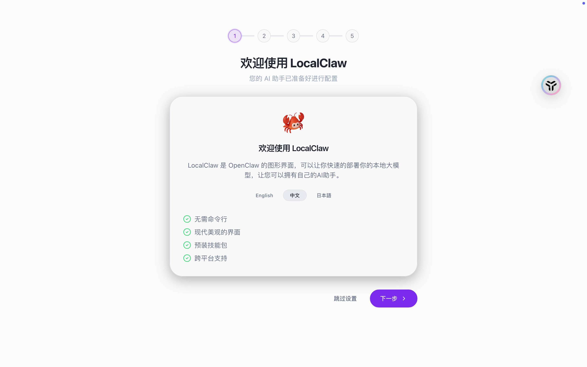

#### 步骤2：部署模式选择

- 进入「设置中」页面，选择你的使用模式：
  - **云端模型**：使用第三方云端API，无需本地配置，即开即用（需要网络，按API计费）
  - **本地部署**：在本地运行开源大模型，数据完全不出本地，保护隐私，零API费用，离线可用
- 选择后点击「下一步」，两种模式的后续流程独立，分别说明：

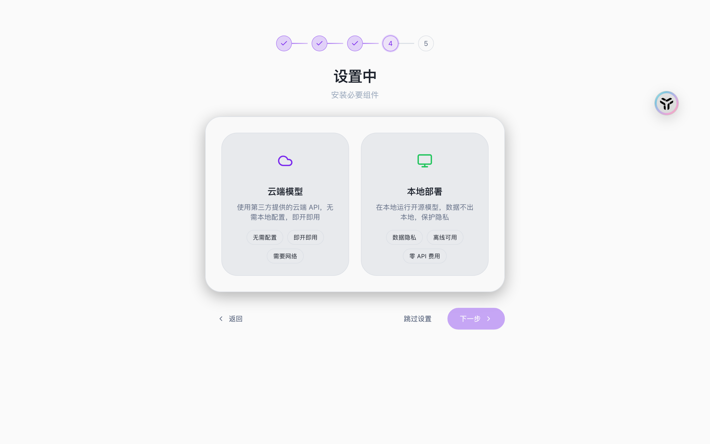

***

### 【模式A：本地部署全流程】

#### 步骤2-1：Ollama 环境检查

LocalClaw 本地部署基于 Ollama 运行，向导会自动完成环境检测与安装：

- 若未安装Ollama：向导将自动触发Ollama的下载与安装流程，下载进度实时可见；也可手动访问[Ollama官网](https://ollama.com/)进行安装（Mac版本约130M，Windows版本约1.1G，Windows用户请耐心等待下载）
- 若已安装：自动检测运行状态与默认端口（11434，需确保端口可用）
- 安装完成后自动进入下一步

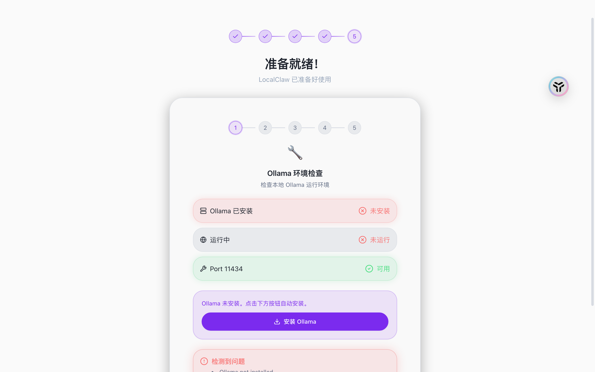

#### 步骤2-2：硬件自动检测

- 向导自动读取你的设备硬件信息：CPU核心数、内存、显存、系统平台
- 确认信息无误后，点击「下一步：选择模型」

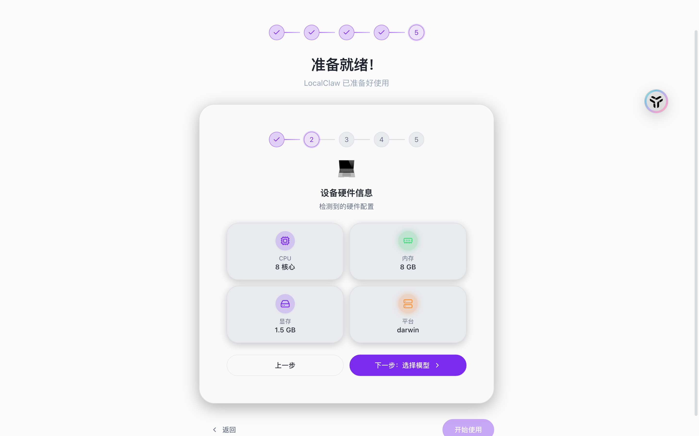

#### 步骤2-3：模型选择

- 向导根据你的硬件配置，自动推荐适配的本地大模型，总共包含20款适合本地大模型：
  - **Qwen 3.5 (0.8B)**：极致轻量化，纯CPU即可流畅运行，适合入门体验（标注「推荐配置」）
  - **Qwen 3.5 (2B)**：超轻量低延迟，响应速度快，适合高配置设备（标注「不推荐」代表当前硬件无法流畅运行）
- 请优先选择**推荐配置**的模型，点击「下一步」

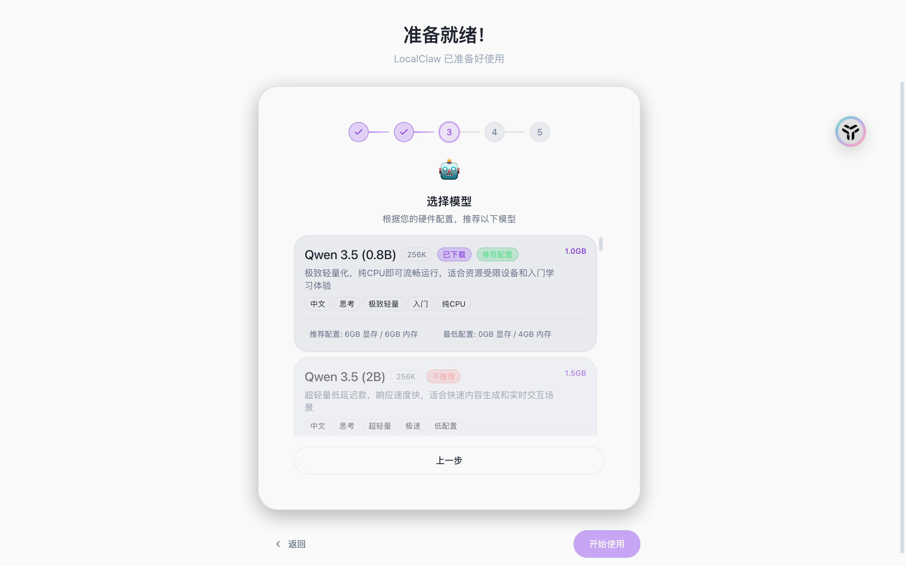

#### 步骤2-4：模型下载

- 确认选中的模型信息（名称、大小），点击「开始下载」
- 等待模型下载完成（0.8B 约1.0GB，2B 约1.5GB，网络不佳可自动续传）
- 下载完成后自动进入下一步

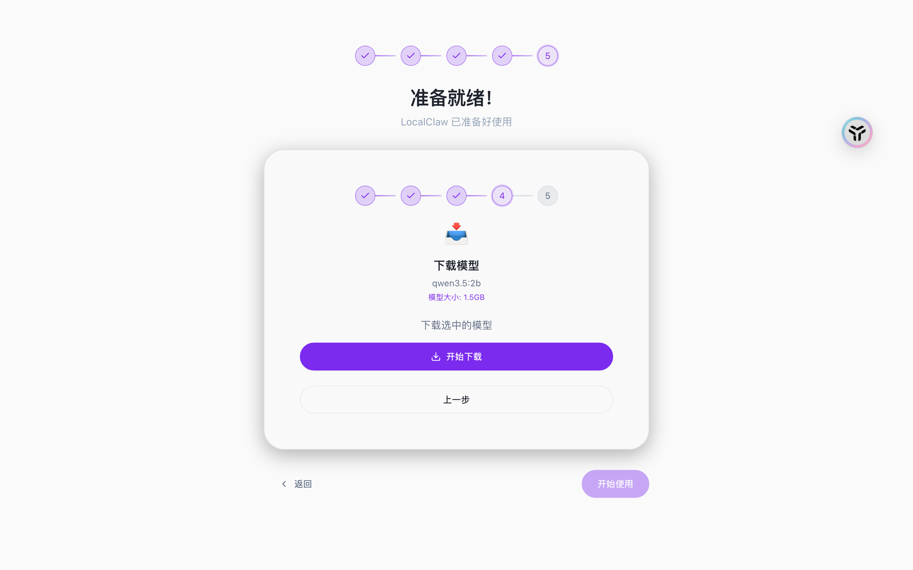

***

### 【模式B：云端模式全流程】

#### 步骤2-1：模型提供商选择

- 进入模型提供商选择页，下拉菜单支持全球主流AI服务商：
  - MiniMax、Moonshot（Kimi）、SiliconFlow、Anthropic（Claude）、OpenAI（GPT）、Google（Gemini）、OpenRouter
- 选择你要使用的服务商，点击「下一步」

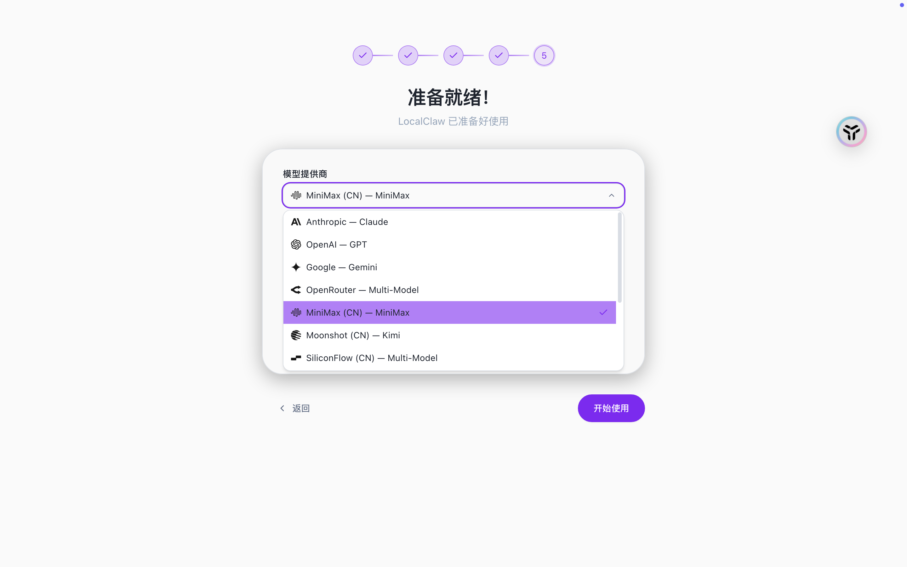

#### 步骤2-2：身份验证

- 选择登录方式：**OAuth 浏览器登录** / **API 密钥输入**
  - OAuth：点击「Login with Browser」，在浏览器中完成授权登录
  - API 密钥：输入你的服务商API密钥，**密钥仅存储在本地，不会上传**
- 验证通过后进入下一步

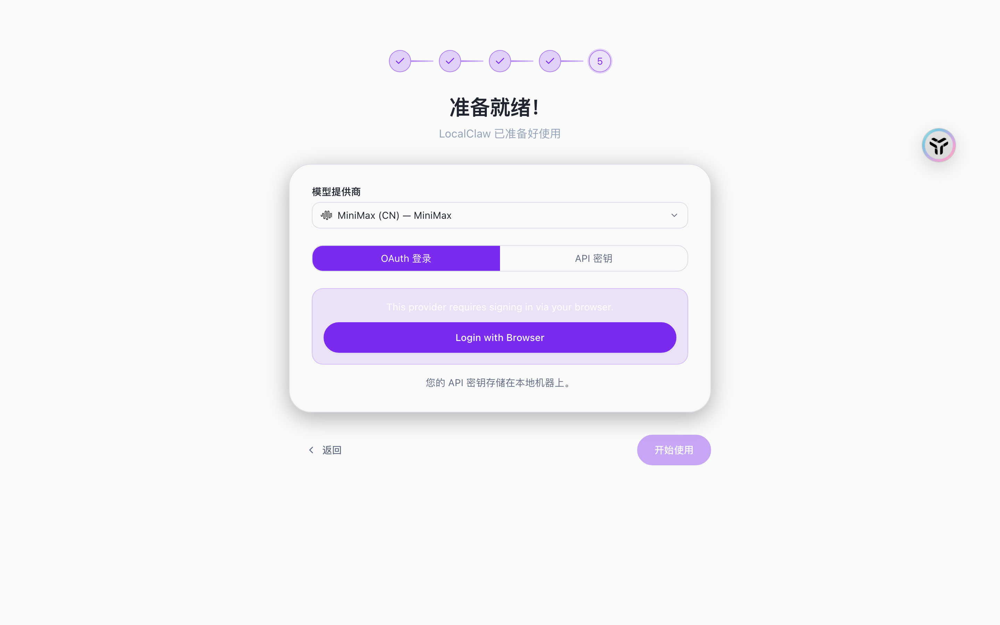

***

### 步骤3：完成设置，开始使用

- 所有配置完成后，进入「准备就绪！」页面，确认部署成功（本地模式显示模型添加成功，云端模式显示服务商配置成功）
- 页面提示后续操作：
  1. 在模型中心管理本地模型和云端模型
- 点击「完成设置」，再点击「开始使用」，即可进入 LocalClaw 主界面，开始使用AI助手！

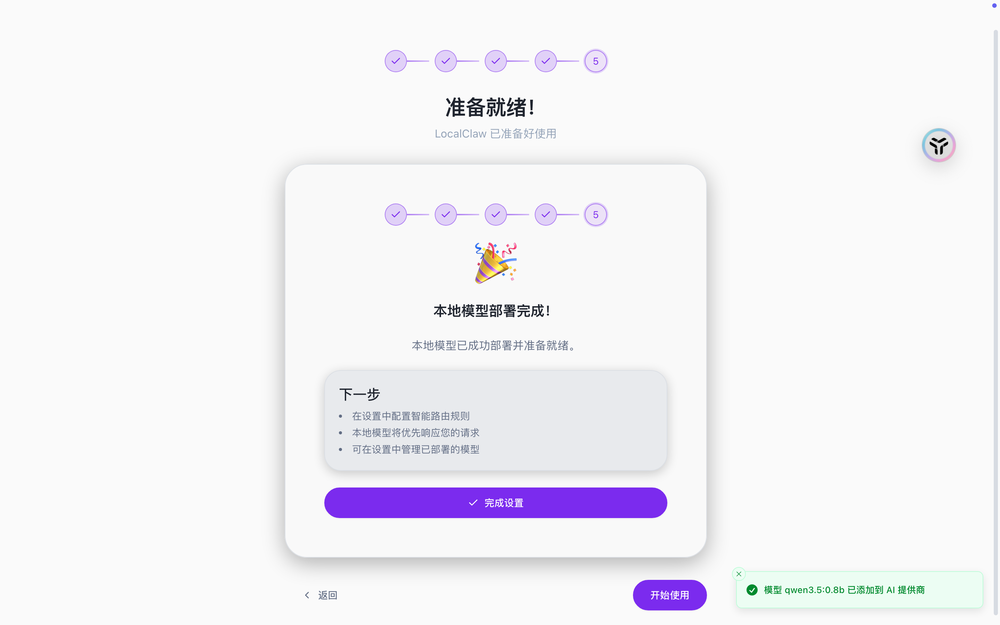

### 步骤4：两种方式对比

| 特性   | 云端模型模式       | 本地部署模式            |
| ---- | ------------ | ----------------- |
| 部署难度 | 无需配置，即开即用    | 一键自动部署，零命令行       |
| 数据隐私 | 数据上传至第三方服务商  | 100%本地存储，数据不出设备   |
| 离线使用 | 不支持，全程需要网络   | 完全支持，下载模型后离线可用    |
| 费用   | 按API调用计费     | 零API费用，仅需首次下载模型   |
| 适用场景 | 快速体验、高算力需求场景 | 隐私敏感、离线使用、长期低成本使用 |

***

## 四、核心功能模块详解

### 4.1 对话界面（AI交互主入口）

这是你和AI交互的核心界面，也是LocalClaw的默认首页：

- **快速发起对话**：点击左侧「+ 新对话」，开启全新聊天会话，支持多会话历史管理。
- **灵活切换能力**：顶部栏可快速切换当前使用的**本地大模型**（如Qwen 3.5 0.8B）或**云端模型**，适配不同场景需求。
- **多模式交互**：支持三种交互模式，满足不同需求：
  - 处理任务：单次问答，快速解决问题
  - 持续执行：长期任务，AI持续跟进
  - 多智能体并行：多Agent协作，复杂任务分角色处理
- **状态实时显示**：底部实时展示网关连接状态，确保服务稳定运行。

***

### 4.2 模型管理中心（AI模型总控枢纽）

一站式管理所有本地/云端AI模型，监控运行状态，一键诊断问题：

#### 4.2.1 快速概览（首页仪表盘）

- **服务状态**：实时显示Ollama服务运行状态、服务地址、版本号。
- **硬件信息**：自动检测CPU、内存、GPU、显存使用情况，一目了然。
- **模型统计**：展示已下载模型数量、运行中模型数、总占用空间。
- **性能监控**：实时图表展示GPU利用率、显存占用，快速排查性能问题。

#### 4.2.2 本地模型管理

- 查看已下载的本地模型列表，包含模型大小、添加时间等信息。
- 点击「+ 添加模型」，一键下载更多适配本地的大模型。
- 点击模型右侧删除按钮，一键清理无用模型，释放存储空间。

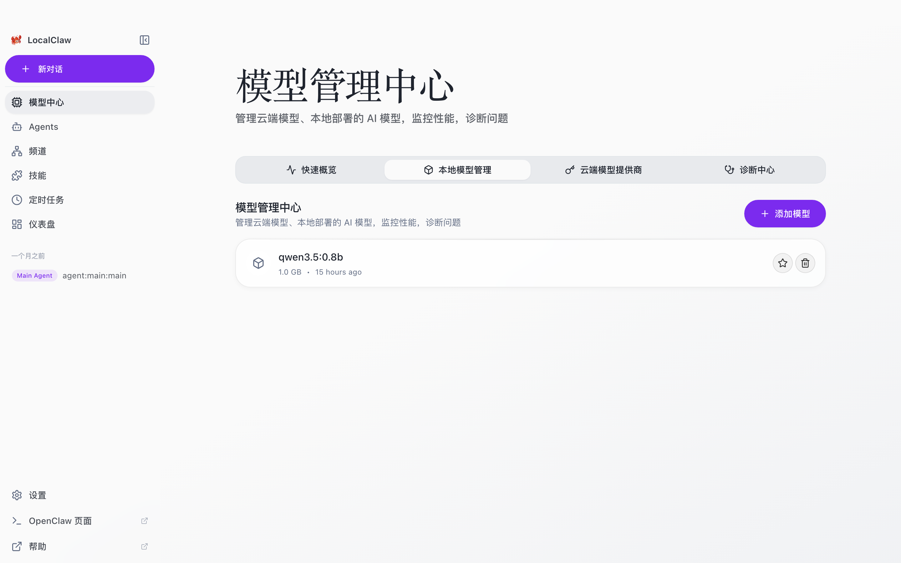

#### 4.2.3 云端模型提供商

- 管理已接入的第三方服务商（如MiniMax、OpenAI、Kimi等），标注「已配置/默认」状态。
- 点击「+ 添加提供商」，快速接入新的云端模型服务，支持OAuth登录/API密钥两种方式。
- 自由设置默认模型，配置智能路由规则，实现本地/云端模型自动切换。

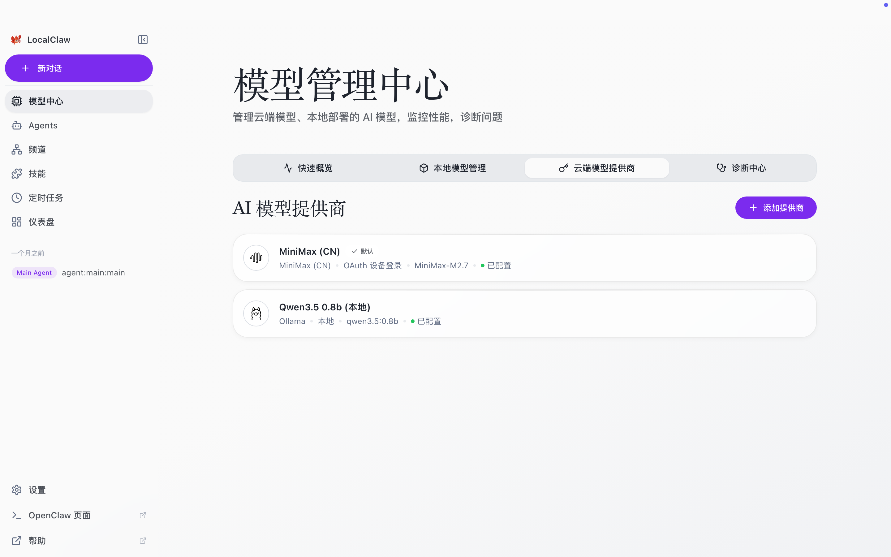

#### 4.2.4 诊断中心

- 点击「开始全面诊断」，自动检测Ollama环境、端口占用、硬件兼容性等问题。
- 诊断完成后提供修复建议，一键解决常见运行异常，无需手动排查。

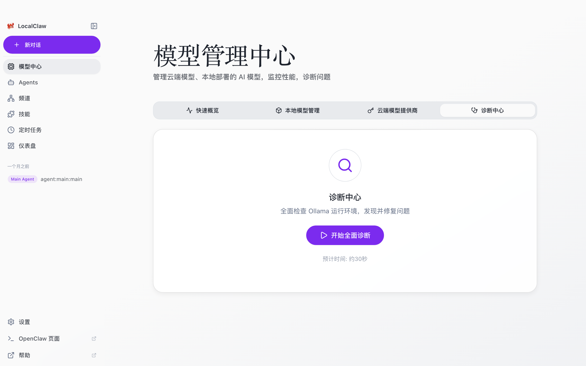

***

### 4.3 仪表盘（系统状态与成本总览）

一站式掌握系统运行状态与AI资源消耗，高效管控：

- **核心状态卡片**：
  - 网关：显示网关运行状态、端口、PID，确保服务连通正常。
  - 频道：展示已连接的消息渠道数量（如微信、飞书等）。
  - 技能：显示已启用的技能数量，快速掌握AI能力范围。
  - 运行时间：展示自上次重启后的运行时长。
- **Token消耗统计**：
  - 支持按模型/按时间筛选，查看近7天/30天/全部的Token使用明细。
  - 清晰展示各模型/服务商的输入、输出、缓存用量，以及对应费用，方便成本管控（本地模型零Token费用）。

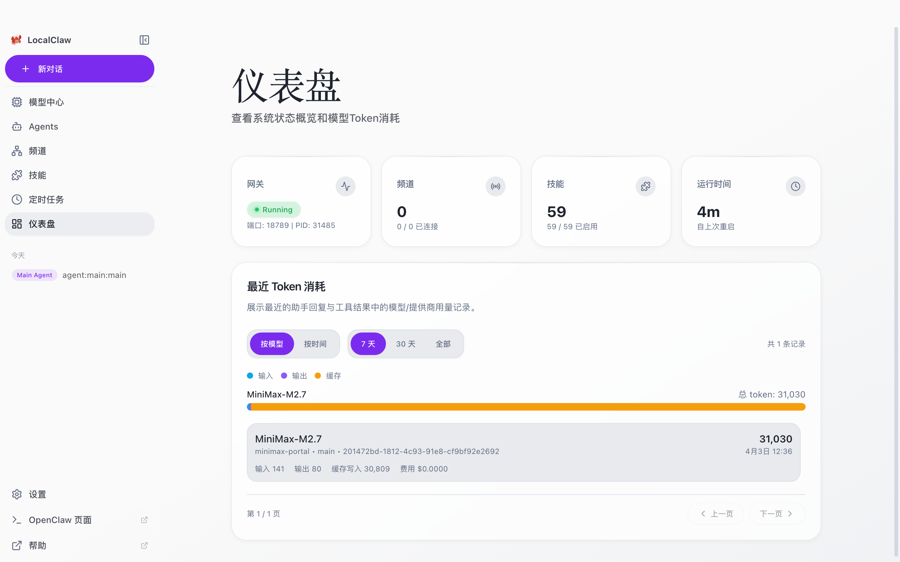

***

### 4.4 技能管理（AI能力扩展中心）

LocalClaw内置50+开箱即用的AI技能，同时支持第三方技能市场，无限扩展AI能力：

- **技能列表管理**：
  - 分类查看「内置技能」「市场技能」，支持搜索、批量启用/禁用。
  - 每个技能卡片展示功能说明、版本号、安装路径，点击开关即可快速启用/停用。
- **技能安装与管理**：
  - 点击「安装技能」，从ClawHub市场搜索并安装第三方技能（如Google Workspace、1Password、笔记管理等工具集成），一键安装，无需额外配置。
  - 支持「打开技能文件夹」，手动管理本地技能文件，自定义扩展能力。

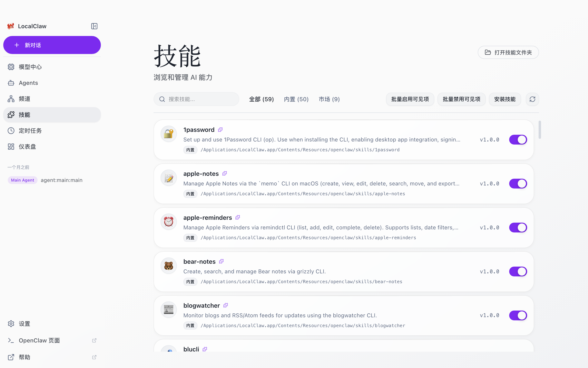

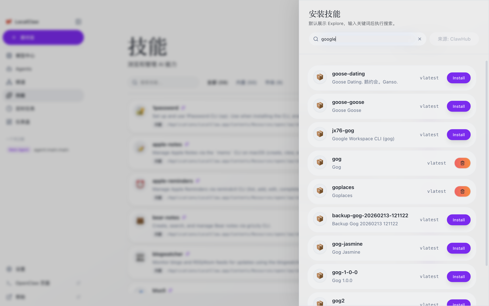

***

### 4.5 Agent管理（多智能体编排中心）

创建专属AI智能体，为不同场景配置专属人格、模型与工作流，实现精准路由：

- **默认Agent**：系统默认创建「Main Agent」，作为全局默认响应智能体，继承基础配置。
- **添加新Agent**：点击「+ 添加Agent」，创建专属智能体，可配置：
  - 专属模型（本地/云端）
  - 技能权限范围
  - 消息频道路由绑定
- **核心价值**：将特定消息频道（如微信、飞书）路由到不同Agent，实现「工作Agent处理办公消息、生活Agent处理私人消息」等场景，灵活分配AI能力。

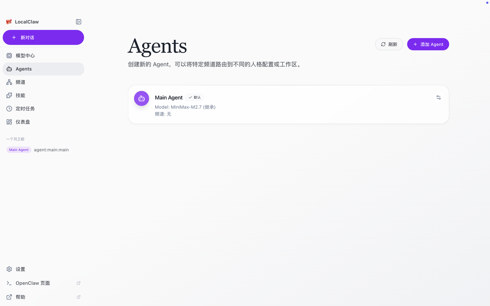

***

### 4.6 定时任务（AI自动化工作流）

通过定时任务实现AI自动化，无需手动触发，自动执行预设工作流：

- **任务总览**：查看所有定时任务的运行状态（运行中/已暂停/失败），支持刷新、启停、编辑。
- **创建任务流程**：
  1. 填写任务名称、AI提示词（如「给我一份今日早间新闻+天气摘要」）。
  2. 选择调度计划：支持每分钟/每5分钟/每小时/每日/每周/每月，或自定义Cron表达式。
  3. 投递设置：选择仅在LocalClaw内保留结果，或推送到已配置的外部消息频道（如微信、飞书）。

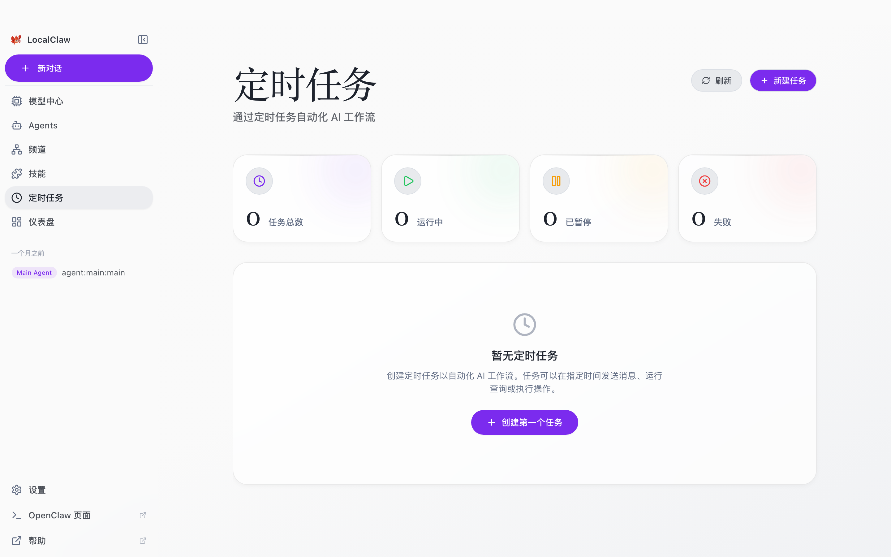

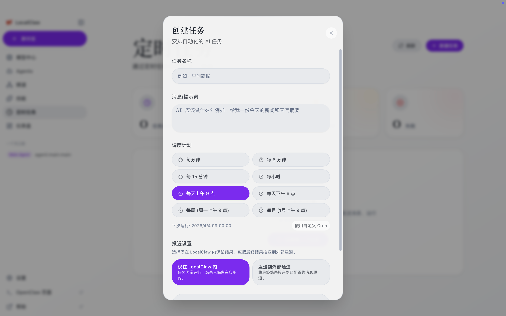

***

### 4.7 消息频道（多渠道AI接入）

统一管理多平台消息渠道，让AI直接响应你的社交/办公消息：

- **全平台支持**：覆盖Telegram、Discord、WhatsApp、微信、钉钉、飞书、企业微信、QQ等主流平台。
- **快速配置**：点击对应渠道，按指引填写API密钥/应用ID，完成机器人创建，即可让AI在对应平台实时响应消息。
- **Agent路由绑定**：将频道绑定到专属Agent，实现不同渠道的AI响应差异化，满足办公、生活等多场景需求。

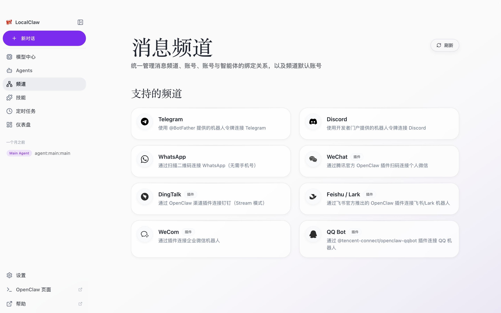

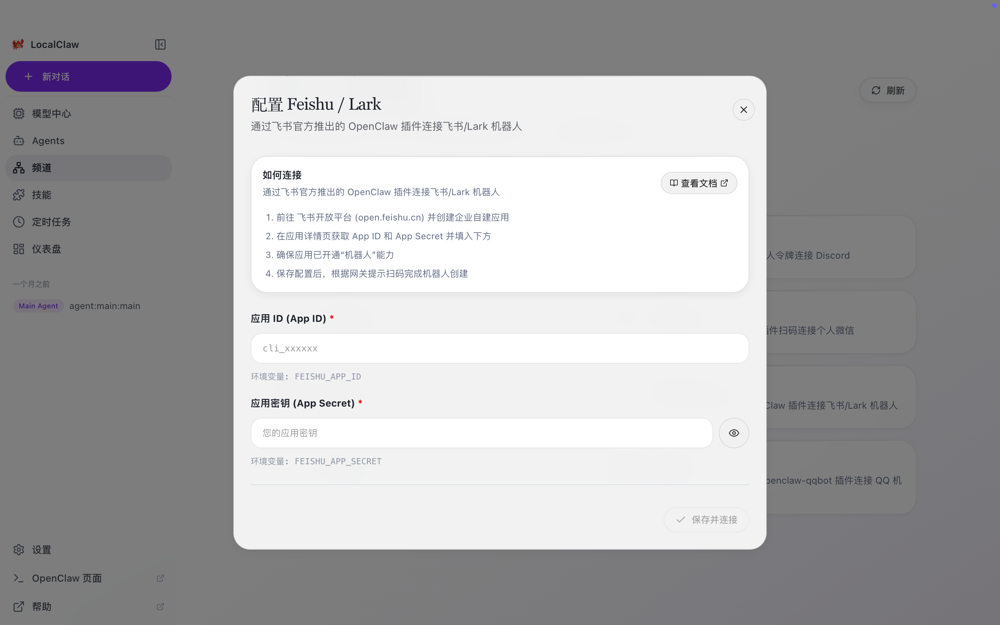

***

## 五、常见问题与排错

### 1. Ollama安装/运行异常

- 解决方案：进入「模型管理中心-诊断中心」，点击「开始全面诊断」，系统将自动检测并修复问题；也可手动前往Ollama官网下载安装，安装前需确保端口11434未被占用。

### 2. 本地模型下载慢/中断

- 解决方案：优先选择体积较小的轻量化模型（如Qwen 3.5 0.8B），可有效提升下载速度；

### 3. 想切换模型/Agent响应优先级

- 解决方案：在「模型管理中心-云端模型提供商」中，将目标模型设为「默认」；在「Agent管理」中，将目标Agent设为默认路由。

### 4. 技能安装失败/无法启用

- 解决方案：先检查技能兼容性，确认系统满足该技能的运行要求；若仍无法启用，可在「技能管理」中重新安装该技能，或手动替换技能文件。

### 5. 定时任务不执行

- 解决方案：先检查定时任务的调度时间设置是否正确，确保LocalClaw处于运行状态；同时确认投递渠道配置无误、网络连通正常，即可恢复正常执行。

***

## 六、联系我们

- **官网**：[https://www.localclaw.me](https://www.localclaw.me)
- **技术支持**：通过[GitHub Issues](https://github.com/Local-AI-X/localclaw/issues) 提交问题，全程为你提供AI使用保障。
- **GitHub**：[https://github.com/Local-AI-X/localclaw](https://github.com/Local-AI-X/localclaw)
- **微信交流群**：

***

💡 **核心提示**：LocalClaw 不止是本地大模型部署工具，更是你的**专属AI工作中枢**。无论你需要本地隐私部署、云端灵活调用，还是自动化办公、多Agent协作，都能在这里一站式实现，完全掌控你的AI数据与体验。

***

## 致谢

LocalClaw 建立在优秀的开源项目之上：

- [OpenClaw](https://github.com/OpenClaw) – AI 代理运行时
- [Electron](https://www.electronjs.org/) – 跨平台桌面框架
- [React](https://react.dev/) – UI 组件库
- [shadcn/ui](https://ui.shadcn.com/) – 精美设计的组件
- [Zustand](https://github.com/pmndrs/zustand) – 轻量级状态管理
- [Ollama](https://ollama.com/) – 本地大语言模型

***

