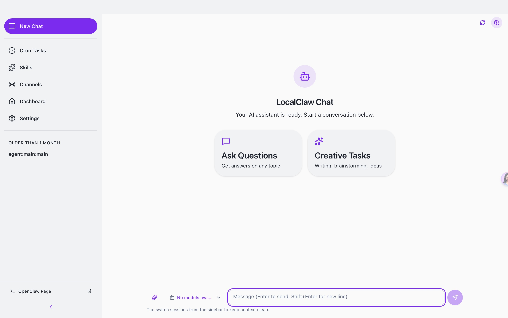
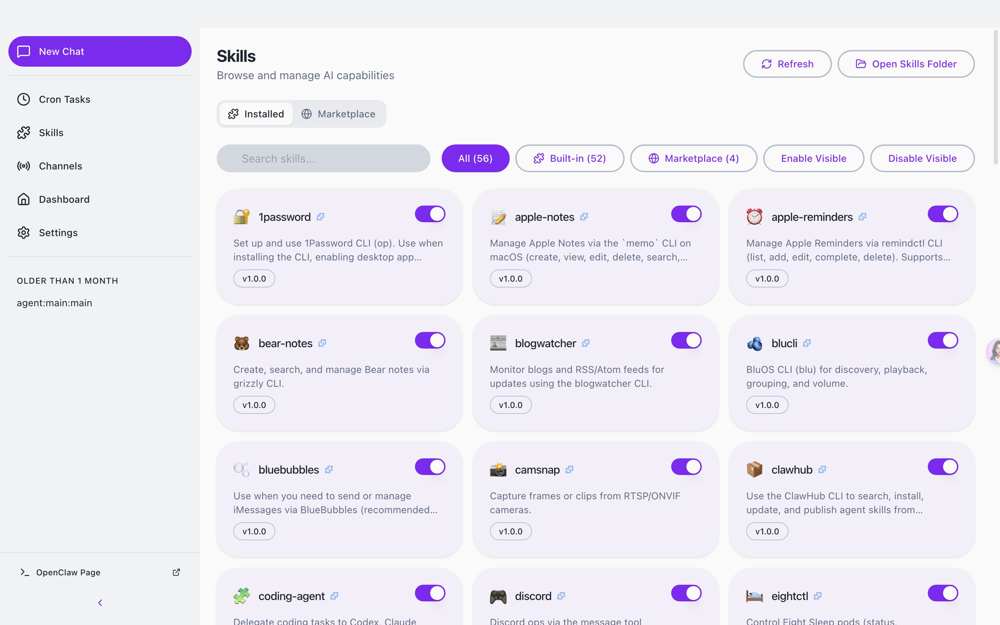
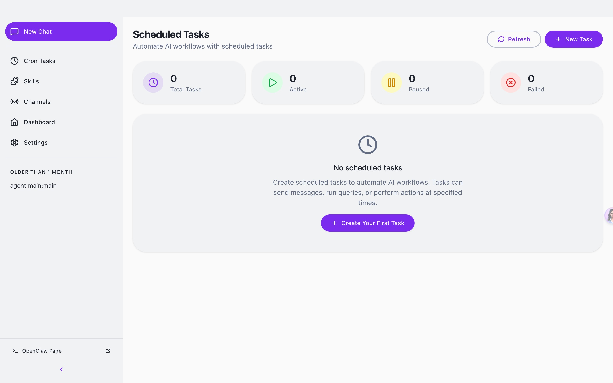
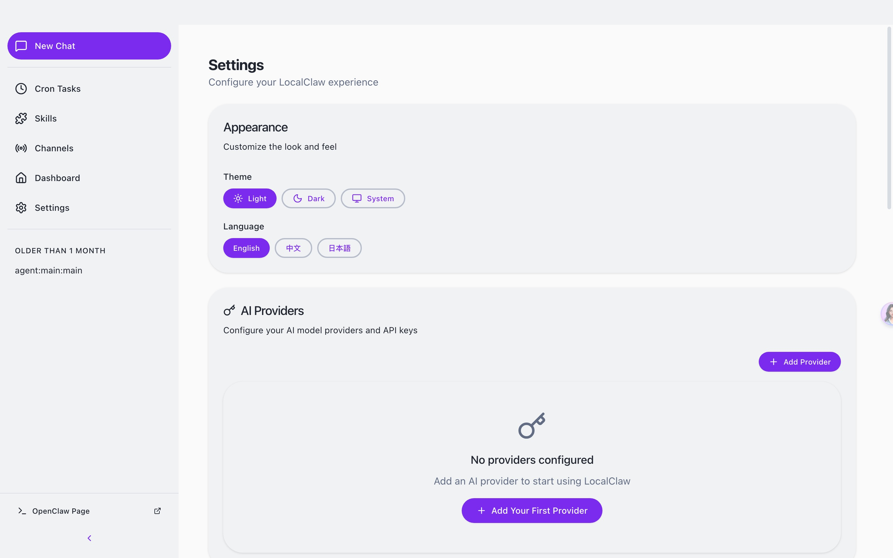
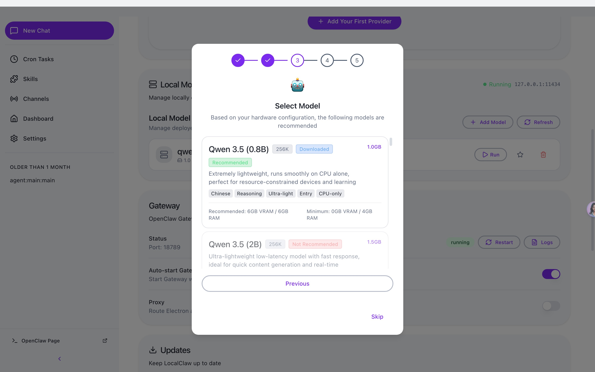

<h1 align="center">LocalClaw</h1>

<p align="center">
  <strong>OpenClaw AI 代理的桌面图形界面</strong>
</p>

<p align="center">
  <a href="#features">功能特性</a> •
  <a href="#why-localclaw">为什么选择 LocalClaw</a> •
  <a href="#getting-started">快速开始</a> •
  <a href="#architecture">架构设计</a> •
  <a href="#ollama">本地模型</a>
</p>

<p align="center">
  <a href="README.md">English</a> | 简体中文 | <a href="README.ja-JP.md">日本語</a>
</p>

***

## 项目概述

LocalClaw 基于 GitHub OpenClaw 构建，是**可部署本地大模型的 OpenClaw 桌面客户端**，专为普通用户打造：

&#x20;

1. 告别命令行 / 终端操作，AI 代理能力可视化、易上手，零基础也能玩转；
2. 预配置优质模型提供商，原生支持 Windows、多语言，进阶可通过开发者模式微调配置；
3. 根据硬件配置匹配对应的可部署的本地大模型，自动调整参数，零门槛、零成本用本地大模型运行 OpenClaw，轻松实现 AI 自由。

***

## 界面预览

<p align="center">
  
</p>

<p align="center">
  
</p>

<p align="center">
  
</p>

<p align="center">
  
</p>

<p align="center">
  
</p>

<p align="center">
  
</p>
---

##

| 挑战         | LocalClaw 解决方案    |
| ---------- | ----------------- |
| 复杂的 CLI 设置 | 一键安装，引导式设置向导      |
| 复杂的模型选择和配置 | 根据硬件自动推荐模型，无需手动配置 |
| 配置文件编辑     | 可视化设置，实时验证        |
| 进程管理       | 自动 Gateway 生命周期管理 |
| 多 AI 提供商   | 统一的提供商配置面板        |
| 技能/插件安装    | 内置技能市场和管理         |

### 内置 OpenClaw

LocalClaw 直接基于官方 **OpenClaw** 核心构建。我们不需要单独安装，而是将运行时嵌入应用程序中，提供无缝的"开箱即用"体验。

我们致力于与上游 OpenClaw 项目保持严格同步，确保您始终能够访问官方版本提供的最新功能、稳定性改进和生态系统兼容性。

***

## 功能特性

### 🎯 零配置门槛

通过直观的图形界面完成从安装到首次 AI 交互的整个设置过程。无需终端命令，无需 YAML 文件，无需寻找环境变量。

### 💬 智能聊天界面

通过现代化的聊天体验与 AI 代理交流。支持多对话上下文、消息历史和 Markdown 富内容渲染。

### 🤖 Ollama 本地模型支持

内置 Ollama 集成，支持本地大语言模型运行：

- 自动检测和启动 Ollama 服务
- 一键下载推荐模型（Qwen、Llama、DeepSeek 等）
- 硬件需求检测和模型推荐
- 支持多模态模型（视觉理解）

### 📡 多频道管理

同时配置和监控多个 AI 频道。每个频道独立运行，允许您为不同任务运行专门的代理。

### ⏰ Cron 定时自动化

调度 AI 任务自动运行。定义触发器、设置间隔，让您的 AI 代理全天候工作，无需人工干预。

### 🧩 可扩展技能系统

通过预建技能扩展 AI 代理能力。通过集成的技能面板浏览、安装和管理技能——无需包管理器。

### 🔐 安全的提供商集成

连接多个 AI 提供商（OpenAI、Anthropic、Moonshot 等），凭据安全存储在系统原生密钥链中。

### 🌙 自适应主题

亮色模式、暗色模式或系统同步主题。LocalClaw 自动适应您的偏好。

### 🔄 自动更新

内置自动更新机制，支持阿里云 OSS（国内用户）和 GitHub Releases 双源更新。

***

## 技术架构

### 双进程架构

LocalClaw 采用**双进程架构**，将 UI 关注点与 AI 运行时操作分离：

```
┌─────────────────────────────────────────────────────────────────┐
│                     LocalClaw 桌面应用                           │
│                                                                  │
│  ┌────────────────────────────────────────────────────────────┐  │
│  │              Electron 主进程                                │  │
│  │  • 窗口和应用生命周期管理                                   │  │
│  │  • Gateway 进程监管                                         │  │
│  │  • 系统集成（托盘、通知、密钥链）                           │  │
│  │  • 自动更新编排                                             │  │
│  │  • Ollama 本地模型服务管理                                  │  │
│  └────────────────────────────────────────────────────────────┘  │
│                              │                                    │
│                              │ IPC                                │
│                              ▼                                    │
│  ┌────────────────────────────────────────────────────────────┐  │
│  │              React 渲染进程                                 │  │
│  │  • 现代化组件化 UI（React 19）                              │  │
│  │  • Zustand 状态管理                                         │  │
│  │  • 实时 WebSocket 通信                                      │  │
│  │  • Markdown 富文本渲染                                      │  │
│  │  • i18n 多语言支持                                          │  │
│  └────────────────────────────────────────────────────────────┘  │
└──────────────────────────────┬──────────────────────────────────┘
                               │
                               │ WebSocket (JSON-RPC)
                               ▼
┌─────────────────────────────────────────────────────────────────┐
│                     OpenClaw Gateway                             │
│                                                                  │
│  • AI 代理运行时和编排                                          │
│  • 消息频道管理                                                  │
│  • 技能/插件执行环境                                            │
│  • 提供商抽象层                                                  │
│  • 设备身份认证                                                  │
└─────────────────────────────────────────────────────────────────┘
```

### 设计原则

- **进程隔离**：AI 运行时在独立进程中运行，确保即使在重计算期间 UI 也能保持响应
- **优雅恢复**：内置指数退避重连逻辑，自动处理瞬时故障
- **安全存储**：API 密钥和敏感数据利用操作系统原生安全存储机制
- **热重载**：开发模式支持即时 UI 更新，无需重启 Gateway

***

## 快速开始

### 系统要求

- **操作系统**: macOS 11+、Windows 10+ 或 Linux（Ubuntu 20.04+）
- **内存**: 最低 4GB RAM（推荐 8GB）
- **存储**: 1GB 可用磁盘空间
- **Node.js**: 22+（开发需要）
- **包管理器**: pnpm 10+（推荐）

### 安装

#### 预构建版本（推荐）

从 [Releases](https://github.com/Local-AI-X/localclaw/releases) 页面下载适合您平台的最新版本。

### 首次启动

首次启动 LocalClaw 时，**设置向导**将引导您完成：

1. **语言与区域** – 配置您的首选区域设置
2. **AI 提供商** – 输入支持的提供商的 API 密钥
3. **技能包** – 选择常见用例的预配置技能
4. **验证** – 在进入主界面之前测试您的配置

> **Moonshot (Kimi) 用户注意**: LocalClaw 默认启用 Kimi 网页搜索。配置 Moonshot 时，LocalClaw 还会将 Kimi 网页搜索同步到 OpenClaw 配置的中国端点 (`https://api.moonshot.cn/v1`)。

### 代理设置

LocalClaw 包含内置代理设置，用于 Electron、OpenClaw Gateway 或 Telegram 等频道需要通过本地代理客户端访问互联网的环境。

打开 **设置 → Gateway → 代理** 并配置：

- **代理服务器**: 所有请求的默认代理
- **绕过规则**: 应直接连接的主机，用分号、逗号或换行分隔
- 在**开发者模式**下，您还可以选择覆盖：
  - **HTTP 代理**
  - **HTTPS 代理**
  - **ALL\_PROXY / SOCKS**

推荐的本地代理示例：

```text
代理服务器: http://127.0.0.1:7890
```

***

## Ollama 本地模型 {#ollama}

LocalClaw 内置对 Ollama 的支持，让您可以在本地运行大语言模型：

### 支持的模型

| 模型                | 大小    | 显存需求  | 特点         |
| ----------------- | ----- | ----- | ---------- |
| Qwen 3.5 (14B)    | 9.4GB | 16GB+ | 中文优化，推理能力强 |
| Qwen 3.5 (7B)     | 4.7GB | 8GB+  | 平衡性能和资源    |
| Llama 3.3 (8B)    | 4.7GB | 8GB+  | 英文场景优秀     |
| DeepSeek R1 (14B) | 9.3GB | 16GB+ | 代码和推理      |
| GLM 4 (9B)        | 6.3GB | 10GB+ | 中文对话       |

### 自动管理

- 启动时自动检测并启动 Ollama 服务
- 根据硬件配置推荐合适的模型
- 一键下载和安装模型
- 后台下载进度实时显示

## 使用场景

### 🤖 个人 AI 助手

配置一个通用 AI 代理，可以回答问题、起草邮件、总结文档，并帮助处理日常任务——全部通过简洁的桌面界面完成。

### 📊 自动化监控

设置定时代理监控新闻源、跟踪价格或观察特定事件。结果将发送到您首选的通知频道。

### 💻 开发者生产力

将 AI 集成到您的开发工作流中。使用代理审查代码、生成文档或自动化重复的编码任务。

### 🔄 工作流自动化

将多个技能链接在一起创建复杂的自动化管道。处理数据、转换内容并触发操作——全部可视化编排。

## 致谢

LocalClaw 建立在优秀的开源项目之上：

- [OpenClaw](https://github.com/OpenClaw) – AI 代理运行时
- [Electron](https://www.electronjs.org/) – 跨平台桌面框架
- [React](https://react.dev/) – UI 组件库
- [shadcn/ui](https://ui.shadcn.com/) – 精美设计的组件
- [Zustand](https://github.com/pmndrs/zustand) – 轻量级状态管理
- [Ollama](https://ollama.com/) – 本地大语言模型

***

## 社区

加入我们的社区，与其他用户交流、获取支持并分享您的经验。

\| 企业微信 | 飞书 |
\| :---: | :---: | :---: |
\|  |  |

***

